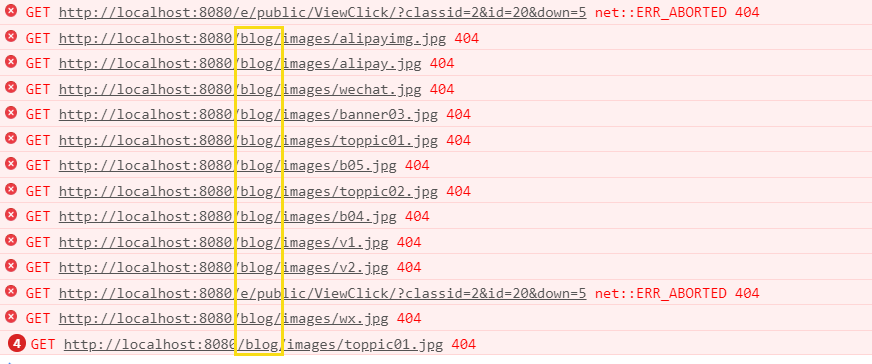

# @RequestMapping映射相对路径问题

我在项目中遇到例如@RequestMapping("/blog/xxx")导致静态资源路径里加上了/blog,以至于无法加载

<!--more-->



关键在于你的静态资源没有<font color="red"> **/** </font>

```html
<link href="/css/base.css" rel="stylesheet">
    <link href="/css/index.css" rel="stylesheet">
    <link href="/css/m.css" rel="stylesheet">
```

所有的静态资源只要加上了<font color="red"> **/** </font>就会变成绝对路径

