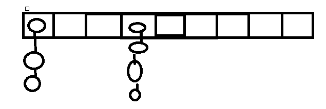
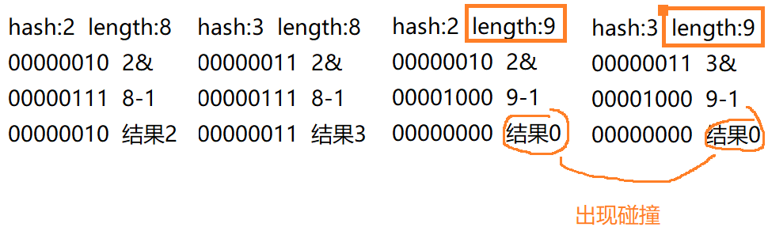
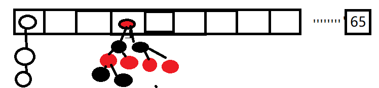

key-value方式存储,线程不安全,因此效率高,键值都可以为空,且无序
<!--more-->
jdk1.8之前是数组+链表形式,构造方法默认创建16长度的`Entry<k,v>[]`数组,任意形式的对象,经过hash算法(**hash%数组长度**)(`hashcode()`)得到一个数,这个数会放在数组中,如果得到相同的hash值(**哈希碰撞**),会经过`equals()`,双重判断为true那么就说明key是相同的,则覆盖掉上一个插入的,为false则说明key不用则会在链表中一个个接着匹配,直到链表所有都是false ,这样才能确定不是重复的key,最后添加到链表尾部中.

1.8之后就优化了,采用**数组+链表+红黑树**的形式,调用`put()`才会创建`Node<k,v>[]`数组也是16长度hash算法(**hash&(长度-1)**)一般长度是2的n次幂最大容量2的30次,为了减少hash碰撞,如果设置初始大小不是2次的,那么会自动转化为大于这个数的最小二次幂,参考hashMap底层 `tableSizeFor(int cap)`方法

- 链表长度大于8,数组长度小于64时,只会形成数组扩容,一位数据量小没必要采用结构复杂的红黑数
- 链表长度大于8,数组长度大于64时,链表会形成红黑树以保证搜索效率,因为红黑树结构原因添加删除效率并不高,只有大数据量下才能利大于弊

加载因子默认是0.75表示16的长度达到16*0.75也就是12时会扩容,当然也是可以自定义的,扩容涉及到rehash,复制数据的过程是非常消耗性能的,因此最好指定合适的初始长度

## 乘积数为什么固定31

31是经过大量统计得出的hash碰撞概率相对比较小并且散列分布相对均匀的一个数，而且31并不是很大经过乘积运算也能在int的取值范围内

## 为什么初始化容量需要2的倍数

如果一个字符串经过hashCode运算得到一个int直接当做数组下标，那这个数组估计要初始化相当大的容量，那是不可能的，因此要取模运算，但是为什么这里用&length-1，而不是%length，因为在length是2的倍数的情况下,与运算比取模运算速度快而且这两个公式得出的结果是一样的 
刚好length又是2的倍数，2的倍数-1那么二进制显示时最后一位一定是1，那么运算后的结果是1或0加强随机性。

## 扰动函数

源码(key == null) ? 0 : (h = key.hashCode()) ^ (h >>> 16)

右移动16位并且异或可以充分利用高位和低位比原先增加随机性并且更加均匀分布减少碰撞，这是经过数据统计的

    

