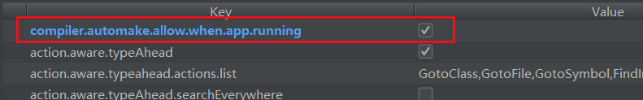
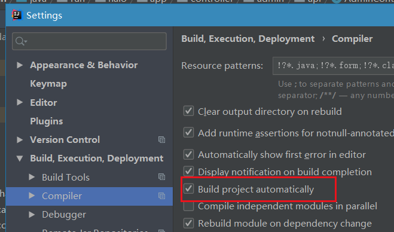

## 关于Spring Boot 项目的热部署

## 如果是Gradle构建

只需在application.properties中加入以下
<!--more-->

## 如果是Maven要在pom.xml加入

### 热部署生效

spring.devtools.restart.enabled: true
### 设置重启的目录

spring.devtools.restart.additional-paths: src/main/java

### classpath目录下的WEB-INF文件夹内容修改不重启

spring.devtools.restart.exclude: WEB-INF/**

热部署jar包
spring-boot-devtools

Ctrl+Shift+Alt+/  选择Register

勾选 Close就好了

集成mybatis

mybatis-spring-boot-starter 

