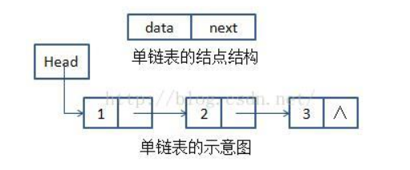

线性表(类似数组)在插入和删除时需要移动大量数据,因为中间动一个数据后续的所有都要移动,这是很浪费性能的但是查询速度是非常快,因为 [基地址+元素大小*k] 就能找到第k个元素的地址,根据地址找到值

如果需要频繁地添加删除,那么就需要链表
<!--more-->
下边我用java模拟单链表



头结点是不记录数据的,指向第一个结点

## 首先定义接口链表的方法

```java
interface ILink<E> {//泛型避免非法类型
	public void add(E e);//添加结点
	public int size();//节点数量
	public boolean isEmpty();//是否为空
	public Object[] toArray();//转换为对象数组
	public E get(int index);//根据下标获取值
	public boolean contain(E data );//是否包含某值
	public void set(int index ,E data);//根据下标修改数据
	public void remove(E data);//删除指定数据
}
```

## 实现接口


```java
class ILinkImpl<E> implements ILink<E>{
	//上述是尾巴
	//下述是头
	private Node root;
	@Override
	public void add(E e) {
		if (e==null) {//如果保存的数据是null,那结束
			return;
		}else {
			Node newNode=new Node(e);//创建新节点
			if (this.root==null) {//为空则是头
				this.root=newNode;
			}else {
				this.root.addNode(newNode);//到这说明有头结点了,那么开始addNode是不是尾巴的判断
			}
			this.count++;
		}
	}
	private int count;//记录个数
	@Override
	public int size() {
		return this.count;
	}
	@Override
	public boolean isEmpty() {
		return this.count==0;
	}
	private int foot;//用于记录数组下标
	private Object[] returnData;//返回的数组
	@Override
	public Object[] toArray() {
		if (this.isEmpty()) {
			return null;
		}
		this.foot=0;//清空下标
		this.returnData=new Object[this.count]; //新建对象数组
		this.root.toArrayNode();//把链表转化为数组
		return this.returnData;
	}
	@Override
	public E get(int index) {
		if (index>=this.count) {//下标超过或等于总个数,那就是null的
			return null;
		}else {
			this.foot=0;//清空下标
			return this.root.getNode(index);
		}
	}
	@Override
	public boolean contain(E data) {
		if (data==null) {
			return false;
		}
		return this.root.containNode(data);
	}
	@Override
	public void set(int index, E data) {
		if (index>=this.count) {//下标超过或等于总个数,那就是null的
			return ;
		}else {
			this.foot=0;//清空下标
			this.root.setNode(index,data);
		}
	}
	@Override
	public void remove(E data) {
		if (this.contain(data)) {//包含该数据再判断
			if (this.root.data==data) {
				this.root=this.root.next;//下一个节点覆盖给当前的
			}else {
				this.root.removeNode(this.root,data);
			}
			this.count--;
		}
	}
	
    //这里是-------------分割线---------------------------
    //定义链表的数据结构
	private class Node{
		private E data;//存储数据
		private Node next;//保存的下一个节点
		public Node(E data){
			this.data=data;
		}
		public void addNode(Node newNode) {//添加节点
			if (this.next==null) {
				this.next=newNode ;//当前结点的下一个节点为空的话说明是最后的结点
			}else {
				this.next.addNode(newNode);//调用自己类似递归
			}
		}
		public void toArrayNode() {//把链表转化为数组
			//下标和链表的数据一一对应
			ILinkImpl.this.returnData[ILinkImpl.this.foot++]=this.data;
			if (this.next!=null) {//只要还有下一个就递归
				this.next.toArrayNode();
			}
		}
		public E getNode(int index) {//从下标0开始递归找,直到找到为止
			if (ILinkImpl.this.foot++==index) {
				return this.data;
			}else {
				return this.next.getNode(index);
			}
		}
		public void  setNode(int index,E data) {//同上
			if (ILinkImpl.this.foot++==index) {
				 this.data=data;
			}else {
				 this.next.setNode(index,data);
			}
		}
		public void  removeNode(Node preNode, E data) {//从下标0开始递归找,直到找到为止
			if (this.data.equals(data)) {//不是头结点的情况,把前边的节点的next指向当前的下一个
				preNode.next=this.next;
			}else {
				if (this.next!=null) {//只要有后续结点,就递归往下找
					this.next.removeNode(this,data);
				}
			}
		}
		public boolean containNode(E data) {
			if (this.data.equals(data)) {//值比较,从开头开始找,找到为止
				return true;
			}else {
				if (this.next==null) {//没有下一个说明找不到了
					return false;
				}else {
					return this.next.containNode(data);//有下一个一直递归
				}
			}
		}
	} 
    
}
```

## main测试

```java
public class lianbiao {
	public static void main(String[] args) {
		ILink<String> aILink=new ILinkImpl<String>();
//		System.out.println(aILink.size());
		aILink.add("java");
		aILink.add("love");
		aILink.add("me");
//		System.out.println(aILink.size());
		aILink.set(2, "you");
		aILink.remove("java");
		for (int i = 0; i < aILink.size(); i++) {
			System.out.println(aILink.toArray()[i]);
		}
//		System.out.println(aILink.get(2));
//		System.out.println(aILink.contain("you"));
//		System.out.println(aILink.contain("love"));
//		System.out.println(aILink.contain("1"));
	}
	/**
	*创建人:
	*项目名:	zhx
	*2019年8月27日-下午8:41:33
	*/
}
```

