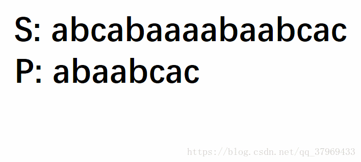
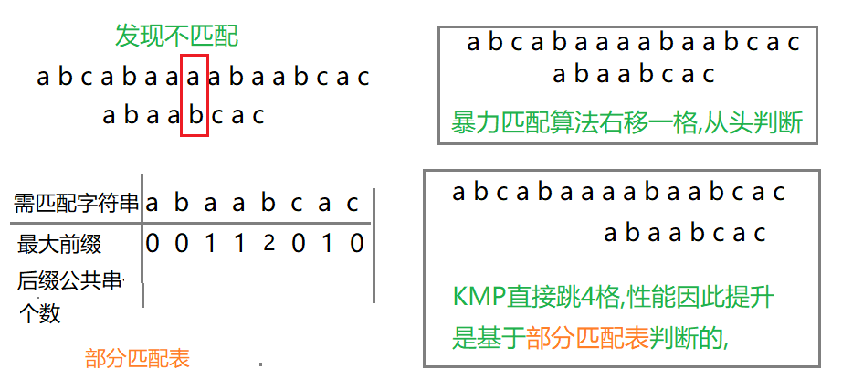

 KMP算法用于匹配字符串,而且是暴力匹配算法的优化版

暴力匹配算法如下图所示,可以看到每次匹配失败时只会前进一格,而KMP算法可以**判断之前已经匹配过的字符而直接前进n格**
<!--more-->

## 暴力匹配算法

如图所示一目了然



```java
public static int matchStr(String str1,String str2) {
		int i=0;//c1的下标
		int j=0;//c2的下标
		//退出循环说明找到了,或者没找到
		while(i<str1.length()) {
			if(str1.charAt(i)==str2.charAt(j)) {
				j++;	
				i++;	
			}else {
				i=i-j+1;//i回退
				j=0;//归零
			}
			//找到了
			if (j==str2.length()) {
				return i-j;
			}	
		}
		//没找到
		return -1;
	} 
```

图片取自https://blog.csdn.net/qq_37969433/article/details/82947411

## KMP算法



### 部分匹配表的实现

**字符串abaabcac**创建部分匹配表的过程

- a无前缀,无后缀自然没有公共串为0
- ab前缀a,后缀b,没有公共串因此为0
- aba前缀a,ab后缀 a,公共串a因此为1
- abaa前缀a,ab,aba后缀a,aa,baa公共串a因此为1
- abaab前缀a,ab,aba,abaa,后缀b,ab,aab,baab公共串ab因此为1
- 同理得到部分匹配表

### 代码实现部分匹配表

```java
//部分匹配表
	public static int[] matchTable(String str) {
		//新建匹配表数组
		int[] arr=new int[str.length()];
		//一个元素无前缀和后缀必须是0
		arr[0]=0;
		for (int i=1 ,j = 0; i < str.length(); i++) {
			//这个很难理解,是kmp算法的规律
			while(j>0&&str.charAt(i)!=str.charAt(j)) {
				j=arr[j-1];
			}
			//前一个和后一个比较相同就+1
			if (str.charAt(i)==str.charAt(j)) {
				j++;
			}
			arr[i]=j;
		}
		return arr;
	}
```

### 改造暴力匹配得到KMP算法

```java
public static int kmp(String str1,String str2,int[] arr) {
	int i=0;//c1的下标
	int j=0;//c2的下标
	while(i<str1.length()) {
		//难理解,这是kmp算法的规律
        //目的是为了有效的回退j,以及不需要回退i
		while(j>0&&str1.charAt(i)!=str2.charAt(j)) {
			j=arr[j-1];
		}
		if(str1.charAt(i)==str2.charAt(j)) {
			j++;	
		}
		//找到了
		if (j==str2.length()) {
			return i-j+1;
		}	
		i++;	
	}
	//没找到
	return -1;
} 
```


