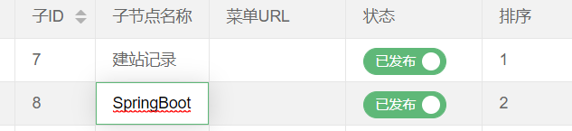

# 思路:

- 修改后的值,改修改的字段名,修改的改行id

- ajax提交,SpringBoot后台自动映射进实体类中

- sql语句 update set 字段=修改后的值 where id=改行id

  

<!--more-->
## 1.要修改的字段加上```edit:true```

table.render那里加


## 2.监听事件

```js
//监听单元格编辑 dataTable 对应 <table> 中的 lay-filter="dataTable"
table.on('edit(LAY-app-content-tags)', function(obj){
    var value = obj.value, //得到修改后的值
        data = obj.data, //得到所在行所有键值
        field = obj.field; //得到字段
    //操作父节点
    if (field.substring(0,1)=="p") {
      var data1 = {};
      data1[field]=value;
      data1["cid"]=data.cid;
        $.post('/config/editMenu1',{pid:data.pid,field:value},function(result){
            if(result.success){layer.msg('修改成功');}
        },'json');
 
    }

});
```

思路就是

## ajax的data中的键是变量

因为field是变量

```js
var data1 = {};
data1[field]=value;
data1["cid"]=data.cid;
  $.post('/config/editMenu2',data1,function(result){
      if(result.success){layer.msg('修改成功');}
  },'json');
```

## 提交后台SpringBoot自动把值注入对象里的属性

## Mybatis自定义字段

```xml
<update id="editMenu1" parameterType="cn.coderzhx.pojo.MenuPojo">
    update menu
    <set>
    <!--set会自动删除最后的逗号-->
        <if test="pname!=null">name =#{pname },</if>
        <if test="purl!=null">url=#{purl},</if>
        <if test="pstatus!=0">status=#{pstatus},</if>
        <if test="porderno!=0">orderno=#{porderno},</if>
    </set>
    where id=#{pid}
</update>
```


后台就可以就可以修改了