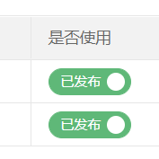

开关,点击后ajax修改数据库0或1状态

<!--more-->

## 1.使用layui 的模板,他就是在script标签里的  1就是已发布 0就是未使用 



```html
<script type="text/html" id="status">
  <input type="checkbox" name="isuse" value="{{d.isuse}}" lay-skin="switch" itemid="{{d.id}}" lay-text="已发布|未使用" lay-filter="link_isuse" {{ d.isuse == 1 ? 'checked' : '' }}/>
</script>
```

itemid这个用来记录该行的主键id

## 2.在table.render里的相应字段加上

```
,toolbar: '#status'
```

## 3.js部分


```js

//改行数据的主键和是否使用1和0传到后台 
function update_useIt(id,useIt){
  $.post('/config/editIsuse',{id:id,isuse:useIt},function(result){
    if(result.success){
      layer.msg('修改成功');
    }
  },'json');
}
//是否显示
form.on('switch(link_isuse)', function(obj){
//获取该行id,   obj.elem.checked绿色就是true即显示,否则就是灰色的
  var id = $(this).attr('itemid');
  if(obj.elem.checked){
    update_useIt(id,1);
  }else{
    update_useIt(id,0);
  }
});
```

