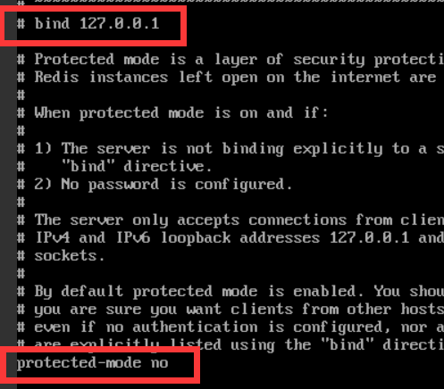
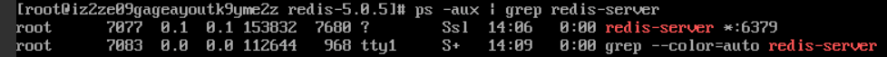

# Linux安装Redis

1. 下载`wget http://download.redis.io/releases/redis-5.0.5.tar.gz`

2. 进入目录解压`tar -xvf redis-5.0.5.tar.gz`
3. 进入redis-5.0.5目录`cd redis-5.0.5/` 之后编译`make install`
4. 启动服务`redis-server`
5. 就出现了经典启动界面


## 外部通过ip连接Redis

需要修改`redis.conf`文件 

1. 进入redis文件夹 `vi redis.conf` 修改文件i修改 esc     :wq 保存
2. 注释掉bind 127.0.0.1 使用# 还有把protected-mode的yes改成no,把daemonize no 改成yes
3. 如果不行,则修改bind 127.0.0.12为0.0.0.0不需要注释
4. 


重启服务` redis-server redis.conf`   意思就是使用配置文件redis.conf启动redis-server 

这个配置文件可以复制多个,使用` redis-server 其他文件.conf`

## 关闭已经启动的Redis

已经存在则关闭服务 `ps -aux | grep redis-server`查看服务端口



关闭服务`kill 7077`

如果报错`redis java.net.SocketException: Connection reset`

只需要等待一段时间就行,读取产生冲突导致

## 启动多个Redis

```
redis-cli //默认端口的Redis
redis-cli -h ip地址  //指定服务器的redis
redis-cli -p 端口号  //指定端口的Redis
redis-cli -h ip地址 -p 端口号 //指定服务器的指定端口的redis
```


修改端口启动时直接后边加端口号就可以修改`redis-server --port 端口号`  ,可用于启动多个Redis服务

此时redis-cli也需要加上端口`redis-cli -p 端口号`

config set requirepass 123456

