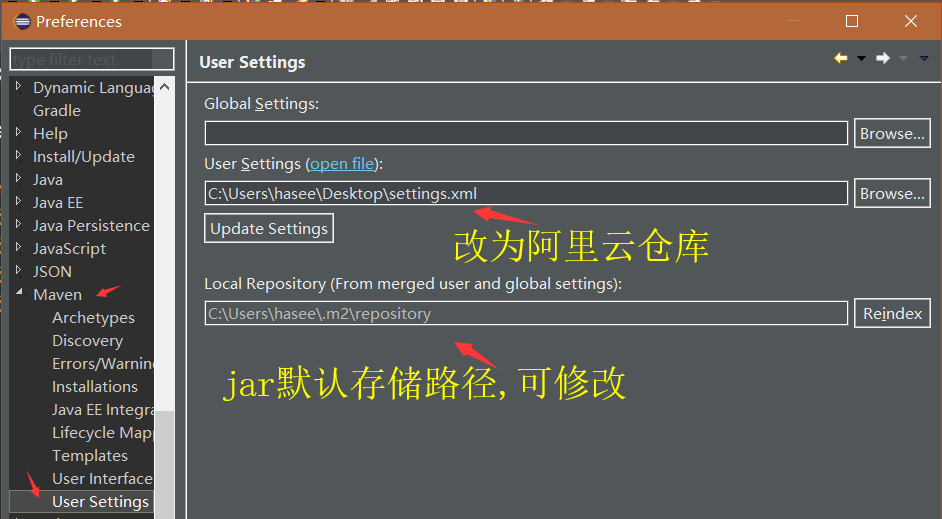
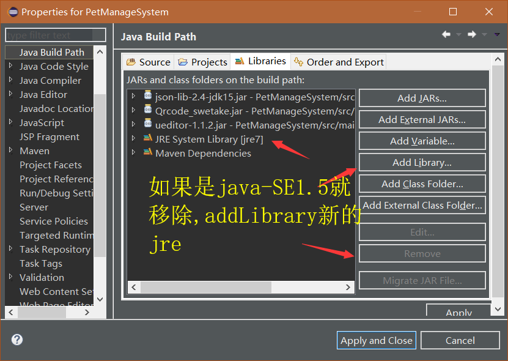
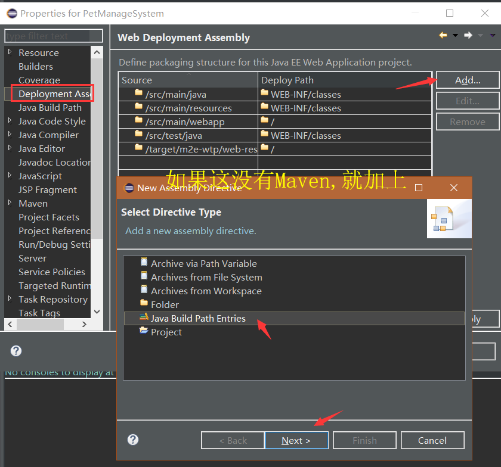
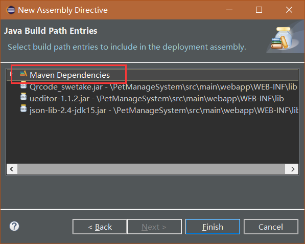

# Maven项目导入注意事项
<!--more-->

## 1.设置仓库为阿里云

**下载Maven**,设置环境变量就不说了,打开windows->preferences

## 2.修改java Build Path

右键项目属性,修改为Java-SE1.7就行

## 3.添加Maven依赖

## 4.Maven install

- 右键项目Run as-Maven Install
- 右键项目Maven -Update Project
- 顺便把Force Update of Snapshot/Releases也勾上
- 仅仅是项目有一个×的话试着运行一下此时如果没报错那就行了
- 报错java.lang.ClassNotFoundException:org.springframework.web.context.ContextLoaderListener是因为更新时候会把依赖去除,需要再次重复3步骤

## 5.其余错误

找到Maven仓库路径关闭Eclipse删除路径下的所有jar包,重新update Project

默认路径C:\Users\hasee\.m2\repository

