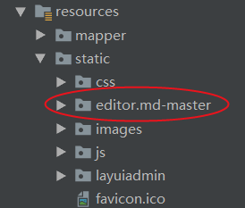
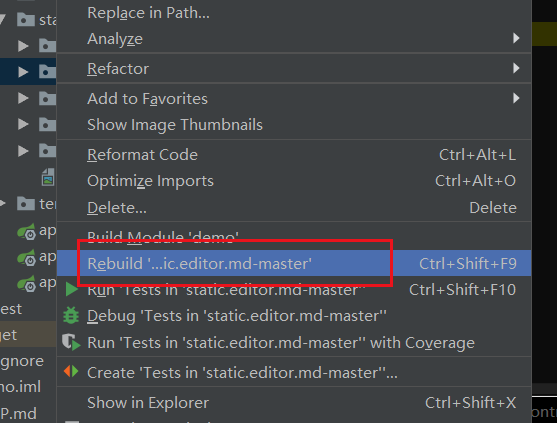
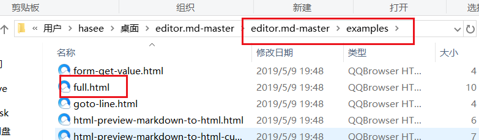
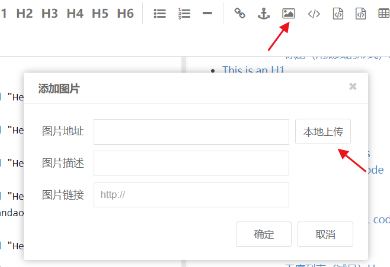
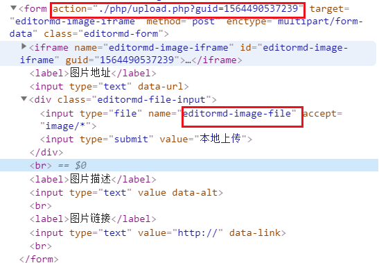
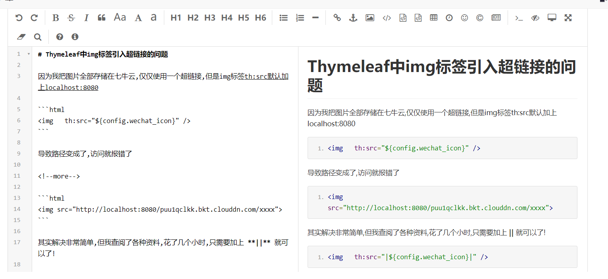
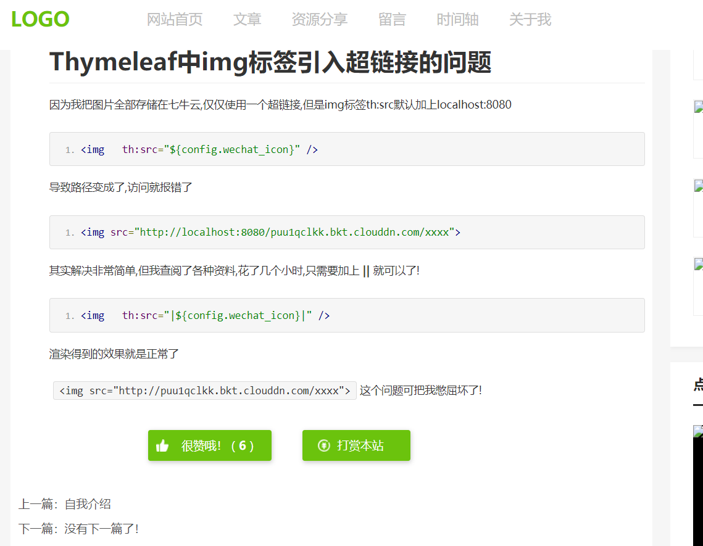

# SpringBoot集成MarkDown编辑器

## 下载文件 [editor.md-master](https://github.com/pandao/editor.md/archive/master.zip)

## 引入Resources

<!--more-->



### 注意要Rebuild一下，否则可能加载不出



### templates中加入full.html



### 注意里边的静态资源引入路径,和js里的path

```html
   <link rel="stylesheet" href="css/style.css" th:href="@{/editor.md-master/examples/css/style.css}"/>
        <link rel="stylesheet" href="../css/editormd.css" th:href="@{/editor.md-master/css/editormd.css}" />
        <link rel="shortcut icon" href="https://pandao.github.io/editor.md/favicon.ico" type="image/x-icon" />
```

```js
 <script src="js/jquery.min.js" th:src="@{/editor.md-master/examples/js/jquery.min.js}"></script>
        <script src="../editormd.js"  th:src="@{/editor.md-master/editormd.js}"></script>
```

```js
<script type="text/javascript">
            var testEditor;            
            $(function() {               
                $.get('/editor.md-master/examples/test.md', function(md){
                    testEditor = editormd("test-editormd", {
                        width: "90%",
                        height: 740,
                        //注意这个路径
                        path : '../../../editor.md-master/lib/',
                        ...........
                      imageUploadURL : "/admin/uploadImg",
                        
```


## 集成Markdown编辑器并解决图片上传问题

### 图片不能直接复制在编辑器上，所以得手动添加




action就是 imageUploadURL的值



后台,返回的路径自己随意设置,只要不被拦截就好

```java
 @Resource
    BlogService blogService;
    @RequestMapping("/admin/uploadImg")
    public String  uploadImg(HttpServletRequest request, @RequestParam(value = "editormd-image-file", required = false) MultipartFile file){
        try {
            //获得web项目的全路径
            String rootPath = request.getSession().getServletContext().getRealPath("/resource/upload/");
            //Calendar.getInstance()是获取一个Calendar对象并可以进行时间的计算，时区的指定
            Calendar date = Calendar.getInstance();
            //获得日期路径,MONTH个值的初始值是0，因此我们要用它来表示正确的月份时就需要加1。
            File dateFile = new File(date.get(Calendar.YEAR)+"/"+(date.get(Calendar.MONTH)+1)+"/"+(date.get(Calendar.DATE)));
            //获得文件最初的路径
            String originalFile = file.getOriginalFilename();
            //得到完整路径名
            File newFile = new File(rootPath+File.separator+dateFile+File.separator+originalFile);

            /*文件不存在就创建*/
            if(!newFile.getParentFile().exists()){
                newFile.getParentFile().mkdirs();
            }
            file.transferTo(newFile);
            String url="/resource/upload/"+date.get(Calendar.YEAR)+"/"+(date.get(Calendar.MONTH)+1)+"/"+date.get(Calendar.DATE)+"/"+file.getOriginalFilename();
            return LayuiJSON.jsonImg(1,"上传成功",url);

        } catch (Exception e) {
            return LayuiJSON.jsonImg(0,"上传失败","");

        }
    }
```

LayuiJSON工具类

```java
 //markdown图片上传
    public static String jsonImg(int success,String msg,String url)  {
        JSONObject obj = new JSONObject();
        obj.put("success",success);
        obj.put("msg", msg);
        obj.put("url", url);
        return obj.toString();
    }
```

解决了

## 页面渲染html

### 页面引入静态资源,jQuery注意要引入

```html
  <link rel="stylesheet" href="/editor.md-master/css/editormd.preview.css" />
  <script src="/editor.md-master/lib/marked.min.js"></script>
  <script src="/editor.md-master/lib/prettify.min.js"></script>
  <script src="/editor.md-master/lib/raphael.min.js"></script>
  <script src="/editor.md-master/lib/underscore.min.js"></script>
  <script src="/editor.md-master/lib/sequence-diagram.min.js"></script>
  <script src="/editor.md-master/lib/flowchart.min.js"></script>
  <script src="/editor.md-master/lib/jquery.flowchart.min.js"></script>
  <script src="/editor.md-master/editormd.min.js" type="text/javascript" charset="utf-8"></script>
```

### 渲染md格式

```html
<!-- 用于显示md编辑器的md格式 -->
<div  id="test-editormd-view">
  <textarea style="display: none;" th:utext="${blogById.content}"></textarea>
</div>
```

### js开启渲染md

```js
  <script type="text/javascript">
          $(function() {
            var testEditormdView;
            testEditormdView = editormd.markdownToHTML("test-editormd-view", {
              htmlDecode      : "style,script,iframe",  // you can filter tags decode
              emoji           : true,
              taskList        : true,
              tex             : true,  // 默认不解析
              flowChart       : true,  // 默认不解析
              sequenceDiagram : true,  // 默认不解析
            });
          });
  </script>
```

### 后台编辑页面



### 前台显示页面



可以了,如果不行那就是资源没有正确引入了