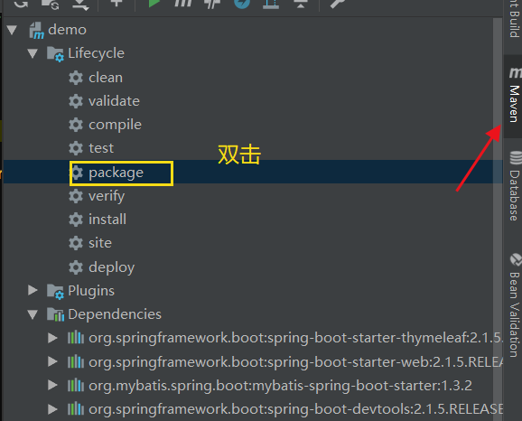
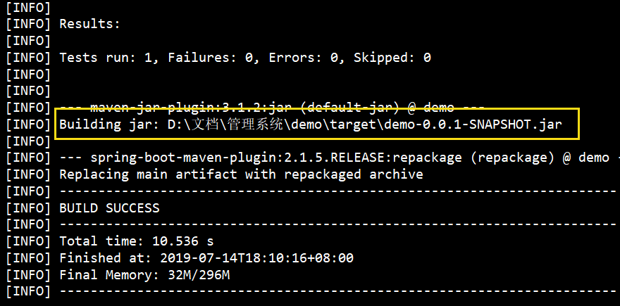
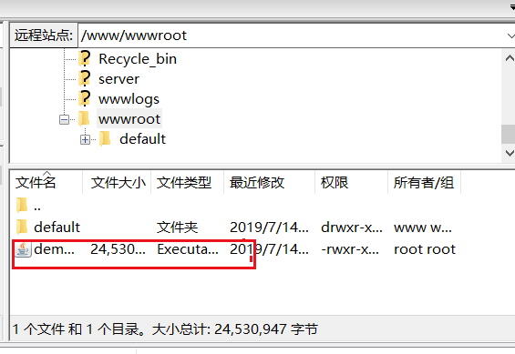
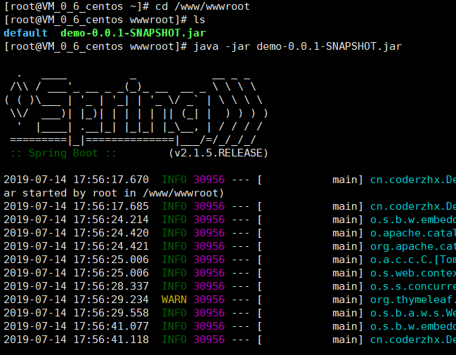
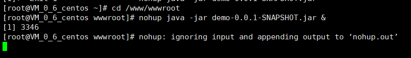
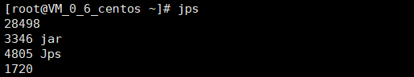
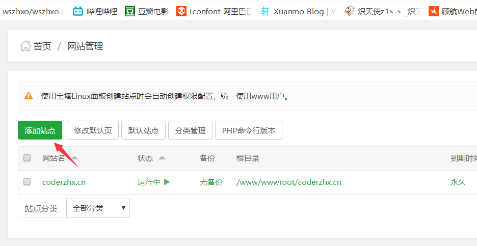
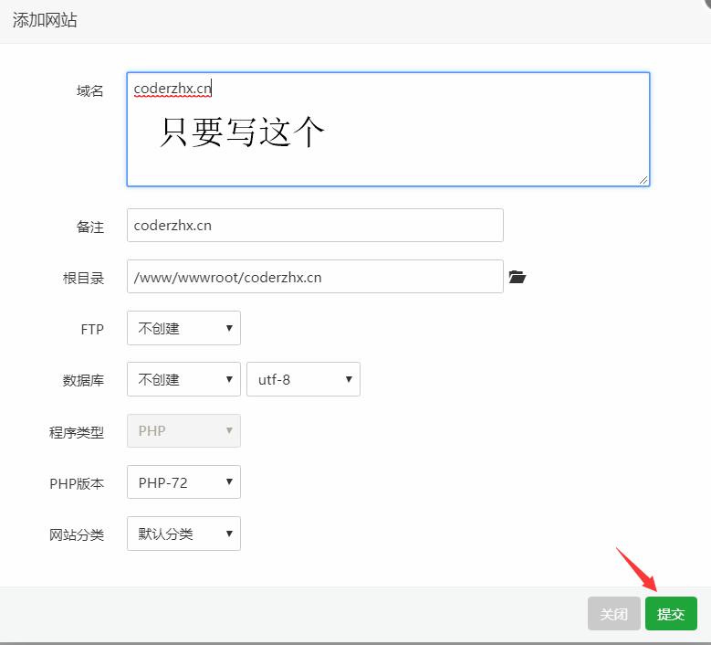
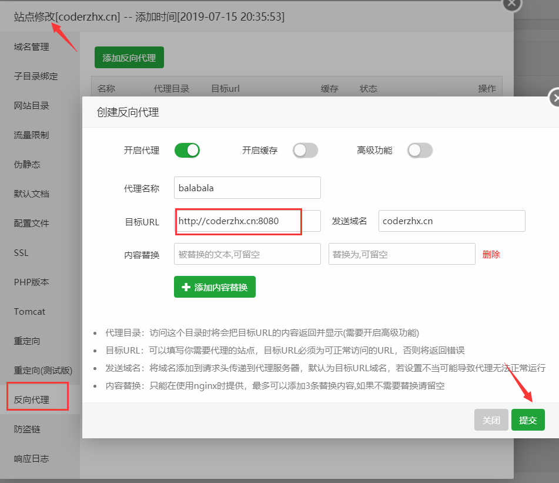
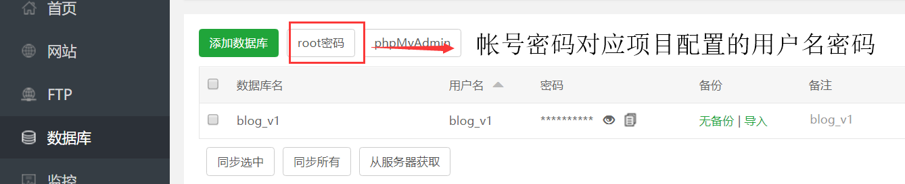

不知道为什么宝塔面板部署SpringBoot项目的时候会报502错误

但是java web项目就没有问题,所以我直接在Linux上操作了

<!--more-->

## 先把SpringBoot项目打包jar






## 把jar包上传到Linux服务器

用XShell软件上传,或者用服务器的宝塔面板,上传完成



### 先进入所在的目录后运行java -jar demo-0.0.1-SNAPSHOT.jar



此时就可以用公网ip:8080/访问了

因为我已经把域名解析到我的主机了所以我可以用域名访问


但是这个关闭了命令控制台就关闭了

## 保持项目一直在服务器运行

```
nohup java -jar demo-0.0.1-SNAPSHOT.jar &
```



这就是运行结果,这样就说明成功了

## 查看日志

当然得进入目录,查看日志了

```
tail -f nohup.out
```

## 关闭项目

```
jps
```



```
kill 3346
```

完成!

## 去掉8080端口

到宝塔面板

添加站点







## **现在就可以把8080去掉了**

## 关于数据库的问题



如果出现Unknown Database 应该是 数据库版本或者数据库驱动出现问题

```com.mysql.cj.jdbc.Driver```改成```com.mysql.jdbc.Driver```

