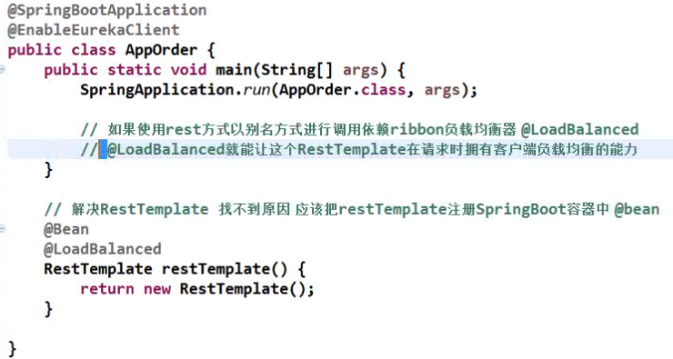
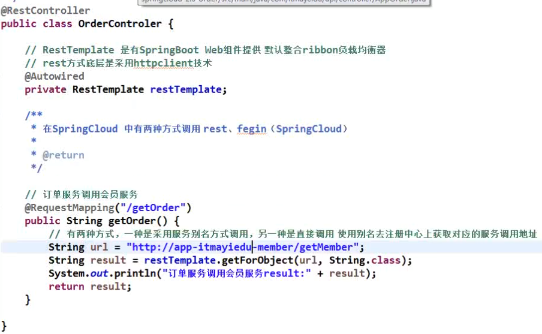

---

title: Springcloud学习
date: 2020-08-18 22:29:59
tags:
  - SpringCloud
  - 分布式
categories: 框架

---

>  单体应用（传统项目）--->  分布式架构 ---->SOA架构----->  微服务架构

# StringCloud

## 单体应用

传统项目，所有的模块都在一个项目中开发，

当项目变大时，开发人员任务不好分配，容易产生冲突，一个模块的错误导致整个项目都不能用

## 分布式架构

将传统的项目拆分成很多个子项目，比如会员项目，订单项目，每个项目都有自己独立的数据库，不同模块部署在不同的服务器上，减轻单台服务器压力

>  注：Maven聚合依赖项目并不是分布式项目，只是单纯的横向拆分多个项目，纵向就是分为常见的controller，service，dao

## SOA架构

分布式的升级版，面向服务，更加细化，分的模块更多，逐渐演变成组件的形式，就是可以共用的一个服务，服务之间采用rpc远程调用机制

> rpc远程调用技术框架有httpclient，spingcloud，dubbo，grpc，底层使用的socket或者netty实现

底层使用SOAP（Http或者Https+xml）或者ESB消息总线实现

##  微服务架构

由于SOA缺少对于服务的治理设施，而且json比xml文件更加轻量化，服务更加细化，每个服务独立部署，数据库也不共享，互不影响，使用restful风格提供API，更加轻量级，更加便于敏捷开发，快速迭代

# SpringCloud 服务注册与发现  

在传统的rpc远程调用中，服务与服务之间的依赖关系比较复杂，耦合度过高，A服务调用B服务，B服务调用C服务，服务URL越来越多的时候就需要使用服务治理技术

### SpringCloud支持的注册中心

注册中心就是存放接口地址信息，有以下三种， Eureka，Consul（go语言写的），Zookeeper

 首先启动注册中心 ，再启动比如（订单服务）（会员服务） 的相关服务，启动时会把服务地址和端口取个别名，相当于键值的形式注册到注册中心（键app_menber值127.0.0.1:8080）

>  Eureka这个注册中心，它可不是什么第三方jar包需要安装什么的，Eureka它本身就是一个SpringBoot，也就是说我们用的是一个项目来充当注册中心。 

服务注册：将服务信息注册到注册中心上

服务发现：从注册中心上获取服务信息

消费者调用接口时就会使用别名（键）从注册中心获取值（具体的url和端口），提供者使用HttpClient技术实现调用

在Application.java中使用注解#EnableEurakaServer，就能把服务注册

调用服务

