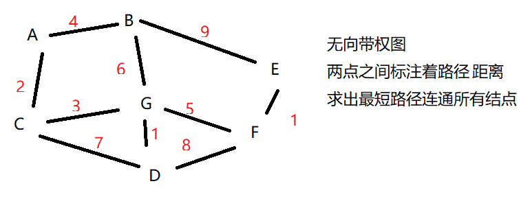
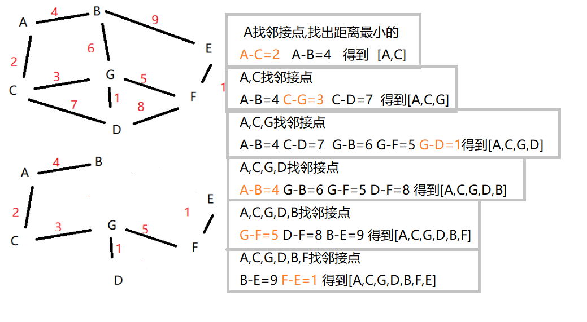
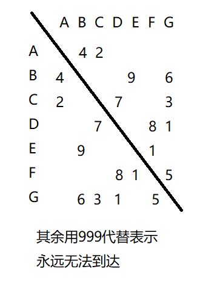

prim算法就是利用了贪心算法的思想，目的是为了在一个无向带权图中找出连通了所有结点而且路径是**最小的路径**,例子,村子修路问题

<!--more-->

## 典型问题

村子需要修路,但要求路要最短而且涉及所有村庄,每个村庄表示一个点,连线表示可供选择的路径,以及距离,那么就可以用无向带权图表示



## 思路





## 生成无向带权图

```java
class PrimGraph {
	int size;// 村庄个数
	int[][] arr;// 村庄之间的距离
	char[] data;// 村庄名
	public PrimGraph(int size, int[][] arr, char[] data) {
		this.size = size;
		this.arr = arr;
		this.data = data;
	}
}
```

## 最短路径核心代码

```java
	//把无向带权图,和初始结点下标 传入
	public static void findMinWay(PrimGraph primGraph,int v ) {
		int [] visited=new int[primGraph.size];
		//初始结点设为已访问
		visited[v]=1;
		//定义下标
		int i=-1;
		int j=-1;
		int max=999;
		//村庄有n个就遍历n-1次
		for (int k = 0; k < visited.length-1; k++) {
			//在已访问的村庄中找没有访问过的村庄线路
			for (int k2 = 0; k2 < visited.length; k2++) {
				for (int l = 0; l < visited.length; l++) {
					//找到路线后max始终保持最小
					if (visited[k2]==1&&visited[l]==0&&primGraph.arr[k2][l]<max) {
						max=primGraph.arr[k2][l];
						i=k2;
						j=l;
					}
				}
			}
			System.out.println("路径:"+primGraph.data[i]+"->"+primGraph.data[j]+" 距离:"+max);
			//把选出来的村庄设置为已访问
			visited[j] = 1;
			max=999;
		}
		
	}
```

## 测试类

```java
public static void main(String[] args) {
		char[] data = new char[] { 'A', 'B', 'C', 'D', 'E', 'F', 'G' };
		int size = data.length;
		//999代表无法到达
		int[][] arr = new int[][] { 
			{ 999, 4, 2, 999, 999, 999, 999 },
			{ 4, 999, 999, 999, 9, 999, 6 },
			{ 2, 999, 999, 7, 999, 999, 3 },
			{ 999, 999, 7, 999, 999, 8, 1 },
			{ 999, 9, 999, 999, 999, 1, 999 },
			{ 999, 999, 999, 8, 1, 999, 5 },
			{ 999, 6, 3, 1, 999, 5, 999 } };
			PrimGraph	primGraph=new PrimGraph(size,arr,data);
    //从B开始
			findMinWay(primGraph,1);
	}
```

## 输出

```java
路径:B->A 距离:4
路径:A->C 距离:2
路径:C->G 距离:3
路径:G->D 距离:1
路径:G->F 距离:5
路径:F->E 距离:1
```

**从哪里开始都是一样的最短距离**