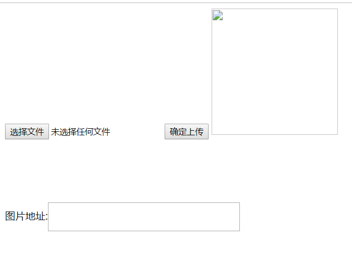
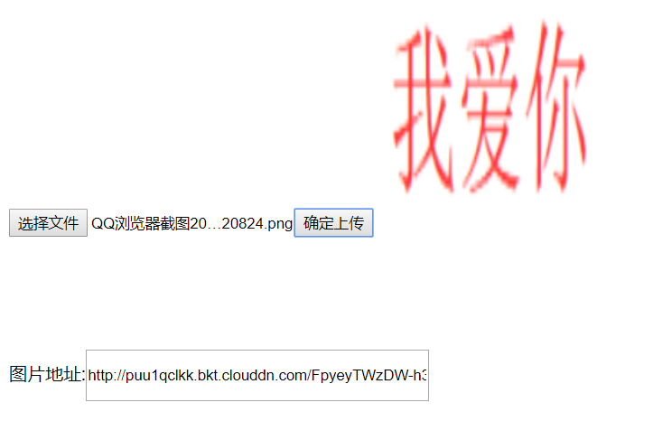

# 七牛云js上传图片

项目中我把所有图片都存到了七牛云里边，所以我构思了一个功能：

## 表单上传的同时，把**图片上传**到七牛云并**返回外链**，以及**预览图片**

## 1.不可行的思路

前台表单上传图片，后台获取图片本地绝对路径，再上传，然而这种想法完全行不通！因为为了安全起见绝对路径已经获取不到了，既然获取不到绝对路径，那就是白搭，不信的可以试试，你会发现你是在浪费时间

<!--more-->

## 2.半可行的思路

利用七牛云的文档https://developer.qiniu.com/kodo/manual/1272/form-upload，我就给你现成的，还有一些表单参数

```html
 <form method="post" action="http://upload.qiniup.com/" id="subform"
       enctype="multipart/form-data">
     <!--图片名-->
  <input name="key" type="test" >
       <!--token后台获取-->
  <input name="token" type="hidden" id="token" >
       <!--图文件-->
  <input name="file" type="file" />
  <button type="submit" value="上传文件" />
 </form>
<script>
    //预先获取token，请求后台直接返回token字符串
 $($.ajax({
  type: "post",
  dataType: "text",
  url: "/admin/uploadqiniu" ,
  success: function (data) {
   $("#token").val(data)
  }
 }));
</script>
```

**SpringBoot集成七牛云看最底下**

这个方法也可以但是他会跳转到一个json字符串的页面，体验极差（*不在乎的可以试一下*，于是我使用了ajax请求http://upload.qiniup.com，但是这属于**跨域请求**，json不支持，得用jsonp，但是用jsonp七牛云又不支持，矛盾，这个方法放弃!

## 3.可行思路

### 思路：

参考了一位网友的文章https://blog.csdn.net/ChinaLiu_Kang/article/details/86613453

把图片信息保存为base64，后把token一起上传到http://upload.qiniu.com/putb64/-1七牛云就可以了！你可以把下面的代码全部复制，自己去测试一定是对的

注意把后台获取的token赋值给qiniutoken，**token的获取一定要预加载**

```html
<input type="file" /><button id="sub">确定上传</button>

<div style="margin-left: auto;margin-top:100px;">图片地址:<input type="text" id="imgUrl" style="width:300px;height: 40px;"></div>
</div>
<script>
 //七牛token 七牛云平台安全标识
 var qiniutoken = '';
 //七牛云图片base64格式上传地址
 var uploadUrl = "http://upload.qiniu.com/putb64/-1";
 //需要上传的图片内容 base64格式
 var imgStr = '';

 //七牛云平台 配置的域名
 var urlHeader = "http://puu1qclkk.bkt.clouddn.com/";

 //获取七牛云token
 // function qnToken() {
  $($.ajax({
   type: "post",
   dataType: "text",
   url: "/admin/uploadqiniu" ,
   success: function (data) {
    qiniutoken=data;
    console.log("认知为:"+qiniutoken)
   }
  }));
 // }

 //上传图片
 function uploadImg() {
  var xhr = new XMLHttpRequest();
  xhr.open("POST", uploadUrl, true);
  //文本类型
  xhr.setRequestHeader("Content-Type", "application/octet-stream");
  //七牛认证信息 注意空格
  xhr.setRequestHeader("Authorization", "UpToken " + qiniutoken);
  xhr.send(imgStr);
  //监听状态
  xhr.onreadystatechange = function() {
   if(xhr.readyState == 4) {
    var result = xhr.responseText;
    console.log('上传请求结果数据:' + result);
    result = JSON.parse(result);
    $("#mypic").attr("src", urlHeader + result.hash);
    $("#imgUrl").val(urlHeader + result.hash);
   }
  }

 }

 //将图片转为base64格式的字符串
 $('input[type=file]').on('change', function() {
  var reader = new FileReader();
  //filses就是input[type=file]文件列表，files[0]就是第一个文件，这里就是将选择的第一个图片文件转化为base64的码
  reader.readAsDataURL(this.files[0]);
  reader.onload = function(e) {
   //或者 e.target.result都是一样的，都是base64码
   imgStr = reader.result.split(',')[1];
   console.log('需要上传的base64格式图片:' + imgStr);
  }
 });


 //开始上传
 $("#sub").click(function(){
  //获取最新token
  // qnToken();
  uploadImg();
 });

</script>
```

预览：






报错的话F12看一下情况，可以发我邮箱问我，或者加我qq

## 集成七牛云

### pom.xml依赖

我也不知道是不是全部有用，反正我全部导入进来了

```xml
<!--七牛云-->
<dependency>
    <groupId>com.qiniu</groupId>
    <artifactId>qiniu-java-sdk</artifactId>
    <version>7.2.11</version>
    <scope>compile</scope>
</dependency>
<dependency>
    <groupId>com.squareup.okhttp3</groupId>
    <artifactId>okhttp</artifactId>
    <version>3.3.1</version>
    <scope>compile</scope>
</dependency>
<dependency>
    <groupId>com.google.code.gson</groupId>
    <artifactId>gson</artifactId>
    <version>2.6.2</version>
    <scope>compile</scope>
</dependency>
<dependency>
    <groupId>com.qiniu</groupId>
    <artifactId>happy-dns-java</artifactId>
    <version>0.1.4</version>
    <scope>compile</scope>
</dependency>
<dependency>
    <groupId>com.squareup.okhttp3</groupId>
    <artifactId>okhttp</artifactId>
    <version>3.3.1</version>
    <scope>compile</scope>
</dependency>
<dependency>
    <groupId>com.google.code.gson</groupId>
    <artifactId>gson</artifactId>
    <version>2.6.2</version>
    <scope>compile</scope>
</dependency>
<!-- 请求头参数分析包 -->
<dependency>
    <groupId>eu.bitwalker</groupId>
    <artifactId>UserAgentUtils</artifactId>
    <version>1.20</version>
</dependency>
<!--七牛云上传图片服务-->
<dependency>
    <groupId>com.qiniu</groupId>
    <artifactId>sdk</artifactId>
    <version>6.1.0</version>
</dependency>
```

### 两个java类

```java
public class VariableName {
    //    七牛AK
    public static final String accessKey = "";
    //    七牛SK
    public static final String secretKey = "";
    //    七牛存储空间名
    public static final String bucket = "";
    //    七牛默认域名
    public static final String domain = "";
}
```

```java
public class QiniuUpload {
        //设置好账号的ACCESS_KEY和SECRET_KEY
        private static String ACCESS_KEY = VariableName.accessKey; //这两个登录七牛 账号里面可以找到
        private static String SECRET_KEY = VariableName.secretKey;

        //要上传的空间
        private static String bucketname = VariableName.bucket; //对应要上传到七牛上 你的那个路径（自己建文件夹 注意设置公开）

        //密钥配置，这个Zone.zone0()不同的空间不一样，华东，华南啥的
        private static Auth auth = Auth.create(ACCESS_KEY, SECRET_KEY);
        private static Configuration cfg = new Configuration(Zone.zone0());
        //创建上传对象

        private static UploadManager uploadManager = new UploadManager(cfg);

        //简单上传，使用默认策略，只需要设置上传的空间名就可以了
        public static String getUpToken(){
            return auth.uploadToken(bucketname);
        }
    
   //我认为这个方法也没用，因为绝对路径的问题，前台获取不到
     public static String UploadPic(String FilePath,String FileName){
            UploadManager uploadManager = new UploadManager(cfg);
            String accessKey = VariableName.accessKey;      //AccessKey的值
            String secretKey = VariableName.secretKey;      //SecretKey的值
            String bucket = VariableName.bucket;                                          //存储空间名
            Auth auth = Auth.create(accessKey, secretKey);
            String upToken = auth.uploadToken(bucket);
            try {
                Response response = uploadManager.put(FilePath, FileName, upToken);
                //解析上传成功的结果
                DefaultPutRet putRet = new Gson().fromJson(response.bodyString(), DefaultPutRet.class);
                //System.out.println(putRet.key);
                //System.out.println(putRet.hash);
                System.out.println(VariableName.domain+"/"+FileName);
                return VariableName.domain+"/"+FileName;
            }catch (QiniuException ex){
                Response r = ex.response;
                System.err.println(r.toString());
                try {
                    System.err.println(r.bodyString());
                } catch (QiniuException ex2) {
                    //ignore
                }
            }
            return null;
        }

    public static void main(String[] args) {
        //测试本地上传
        UploadPic("f://test","222");
    }

    
 }
```

