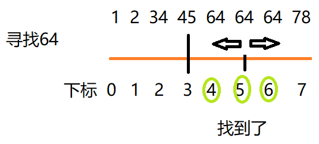

二分查找也称折半查找（Binary Search），它是一种效率较高的查找方法。但是，折半查找要求线性表必须采用顺序存储结构，而且表中元素按关键字有序排列。

在有序序列的条件下才可以进行二分查找,找中间的值,再分别往两边找,一直找中间

<!--more-->

## 有序且不重复时使用(不完整)

以中间值作为分界点,进行左右递归找到为止

### 递归版本

```java
public static int binarySearch(int[] arr,int left,int right,int value) {
		//用于不存在数字的情况
		if (left>right) {
			return -1;
		}
		int mid=(left+right)/2;
		if (arr[mid]<value) {
			return binarySearch(arr,mid+1,right,value);
		} else if (arr[mid]>value) {
			return binarySearch(arr,left,mid-1,value);
		}else {
			return mid;
		}	
	}
```

### 非递归版本

```java
public static int binarySearch3(int[] arr,int value) {
		int left=0;
		int right=arr.length-1;
		//用于不存在数字的情况
		while(left<=right) {
			int mid=(left+right)/2;
			if (arr[mid]<value) {
				 left=mid+1;
			} else if (arr[mid]>value) {
				 right=mid-1;
			}else {
				return mid;
			}
		}
		return -1;
	}
```


## 有序且不重复时使用(优化版本)也加插值查找


中值采用了算法公式中间值,数据量大的情况下,可以自适应,速度更快

int mid=left+(right-left)*(value-arr[left])/(arr[right]-arr[left]);

```java
//差值查找,主要是中值采用了合适的算法,不适用重复
	public static int insertValueSearch(int[] arr,int left,int right,int value) {
		
		//用于不存在数字的情况
		if (left>right||arr[0]>value||arr[arr.length-1]<value) {
			return -1;
		}
		int mid=left+(right-left)*(value-arr[left])/(arr[right]-arr[left]);
		if (arr[mid]<value) {
			return binarySearch(arr,mid+1,right,value);
		} else if (arr[mid]>value) {
			return binarySearch(arr,left,mid-1,value);
		}else {
			return mid;
		}
	}
```


## 有序,有重复元素时使用(优化版)


找到值后加入到一个集合中比如int[] arr = { 1,2,34,45,64,64,64,78 };

可以看到相同的都是放在一起的,如果已经确定了中值就是要找的值,

那么往左边右边看看是否还有,没了那说明真的没了



```java
//仅限于有序列表
	public static LinkedList<Integer> binarySearch2(int[] arr,int left,int right,int value) {
		int mid=(left+right)/2;
		//比中值小,那在左边
		if (arr[mid]<value) {
			return binarySearch2(arr,mid+1,right,value);
		//比中值大,那在右边
		} else if (arr[mid]>value) {
			return binarySearch2(arr,left,mid-1,value);
		}else {
			//就是中间值
			LinkedList<Integer> linkedList=new LinkedList<Integer>();
			//左边找
			int temp=mid-1;
			while (true) {
				//temp已经在下标为0处,那一定是找不到了
				//既然是有序的相同的一定是放在一起的,这个值的左边如果也是相同那就找到了
				if (temp<0||arr[temp]!=value) {
					break;
				}
				linkedList.add(temp);
				temp--;
			}
			//中间的值
			linkedList.add(mid);
			//右边找
			temp=mid+1;
			while (true) {
				//temp已经在下标为0处,那一定是找不到了
				//既然是有序的相同的一定是放在一起的,这个值的边如果也是相同那就找到了
				if (temp>arr.length-1||arr[temp]!=value) {
					break;
				}
				linkedList.add(temp);
				temp++;
			}
			return linkedList;
		}
		
	}
```


