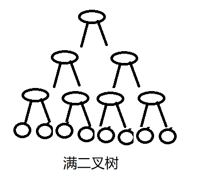
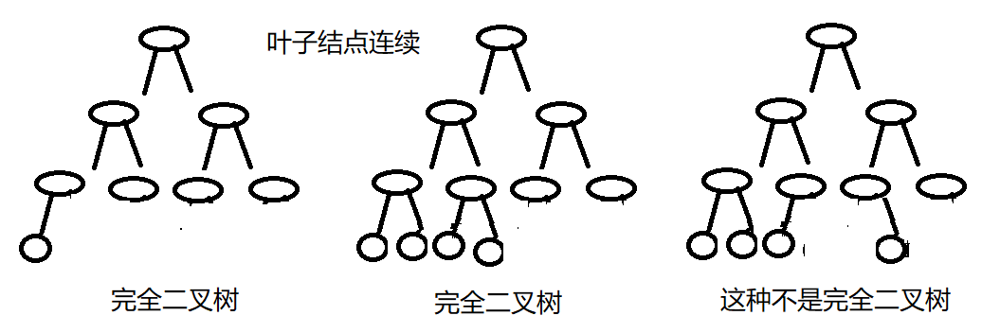
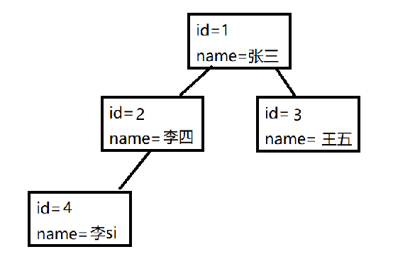

一棵深度为k，且有2^k-1个结点的二叉树，称为满二叉树。这种树的特点是每一层上的结点数都是最大结点数。而在一棵二叉树中，除最后一层外，若其余层都是满的，并且或者最后一层是满的，或者是在右边缺少连续若干结点，则此二叉树为完全二叉树。深度为k的完全二叉树，至少有2k-1个叶子结点，至多有2k-1个结点。
<!--more-->

## 为什么会有二叉树

ArrayList(数组集合)的底层是数组实现的,数组结构查询会比较快,但是数组是固定长度,添加时是创建的新数组,原数据拷贝再把新数据加到对饮的位置,默认扩容是原来的1.5倍

LinkedList(链表集合)的底层是链表,插入元素,只需要操作next就可以,可是查询非常慢,因为要从头遍历查询,

因为两者的缺点存在,才有了二叉树的出现二叉树就结合了两种集合的优点,插入和查询都比较快.

## 满二叉树

**满二叉树是完全二叉树的特殊情况**



## 完全二叉树



## 面向对象设计二叉树

### 结点实体类(Man)

```java
class Man{
	public  int  id;
	public String name;
	public Man left;//左结点
	public Man right;//右结点
	public Man(int id, String name) {
		this.id = id;
		this.name = name;
	}
	@Override
	public String toString() {
		return "Man [id=" + id + ", name=" + name + "]";
	}
	
	//前序遍历
	public void pre() {
		//中
		System.out.println(this);
		//左
		if (this.left!=null) {
			this.left.pre();
		}
		//右
		if (this.right!=null) {
			this.right.pre();
		}
	}
	//中序遍历
	public void mid() {
		//左
		if (this.left!=null) {
			this.left.mid();
		}
        //中
		System.out.println(this);
        //右
		if (this.right!=null) {
			this.right.mid();
		}
	}
	//后序遍历
	public void behind() {
        //左
		if (this.left!=null) {
			this.left.behind();
		}
        //右
		if (this.right!=null) {
			this.right.behind();
		}
        //中
		System.out.println(this);
	}
}
```

### 二叉树

```java
class BinaryTree{
    //根结点
	public  Man root;
	
	@Override
	public String toString() {
		return "binaryTree [root=" + root + "]";
	}
	//先序遍历
	public void pre() {
		if (this.root!=null) {
			this.root.pre();
		}else {
			System.out.println("前序遍历结点为空");
		}
	}
	//中序遍历
	public void mid() {
		if (this.root!=null) {
			this.root.mid();
		}else {
			System.out.println("中序遍历结点为空");
		}
	}
	//后序遍历
	public void behind() {
		if (this.root!=null) {
			this.root.behind();
		}else {
			System.out.println("后序遍历结点为空");
		}
	}
} 
```

### 测试类(手动插入结点)

```java
		Man man=new Man(1, "张三");
		BinaryTree binaryTree =new BinaryTree();
		binaryTree.root=man;//根结点
		Man man2=new Man(2, "李四");
		Man man3=new Man(3, "王五");
		man.left=man2;
		man.right=man3;
		Man man4=new Man(4, "李si");
		man2.left=man4;
		binaryTree.pre();//先序遍历  1 2 4 3
        binaryTree.mid();//中序遍历 4 2 1 3
		binaryTree.behind();//后序遍历 4 2 3 1
```



### 这就是单纯的二叉树,平衡二叉树才是插入,查询高效的关键没后续会讲!

