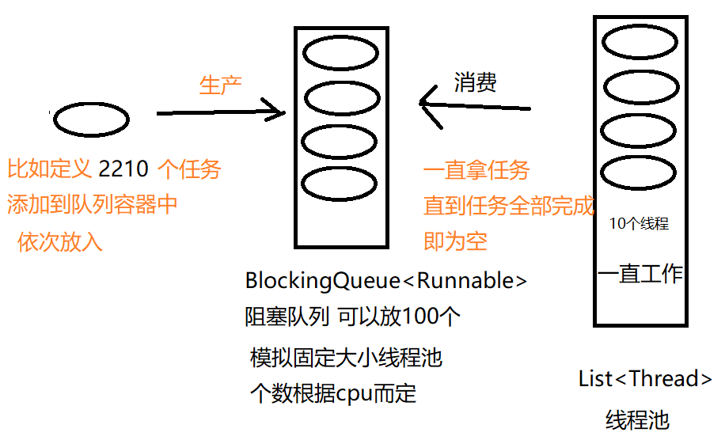

# 什么是多线程


一个软件相当于一个进程,其中包含了多个线程,

## 1.多线程的目的

为了提高软件的执行效率.

- 比如单线程下的添加功能:前台传输数据到后台再添加到数据库,其中连接数据库,写入,是耗时操作,使用磁盘资源,但是cpu是空闲的,意思就是同时只能做一件事,利用多线程,使用cpu做其他操作,这就相当于两个线程同时工作!

- AOP处理日志:AOP写日志花费2s,剩下操作花费2s,那么可以让写日志单独开启线程操作,这样总的时间还是2s,这就是多线程的好处!


## 2.多线程问题

### 2.1.线程安全问题

多个线程同时共享一个全局变量,可能被其他线程干扰.(锁解决)(乐观cas)(悲观lock,syn)

### 2.2.获取异步结果

主动根据业务id查询(**这个暂时不理解**)

### 2.3.死锁问题

其他文章有介绍


## 3.多线程生命周期

首先新建线程,调用start()后进入就绪状态,得到cpu执行权才会运行,sleep(),join()锁,wait(),就会进入阻塞状态,sleep()时间到或者获取锁,又会进入就绪状态,循环,最后死亡

## 线程池的引入

由于start()和stop()对cpu消耗大,因此要复用线程,不能让线程停止(死循环while)

### 线程池优点

- 正是由于减少了start的步骤,因此减少了cpu的调度,

- 复用线程

- 统一维护管理线程

## 线程池创建方式

核心EXecutors类封装了4种构造函数ThreadPoolExecutor

- 可缓存   缓存最大数Integer的最大值

- 自定义长度(固定数)

- 可定时

- 单例

  常用方式是自定义长度根据cpu核心数而定

  

## 线程池核心原理

- 提前创建线程,并保持运行状态,使用ThreadPoolExecutor创建
- 使用execure把任务加入队列中
- 线程不断获取任务,前提是有的话,获取到就运行


## 模拟线程池




```java
package 多线程;

import java.util.ArrayList;
import java.util.List;
import java.util.concurrent.BlockingQueue;
import java.util.concurrent.LinkedBlockingDeque;

public class ExecutorService {
	private List<Thread> workThreads;// 一直运行的线程集合
	private BlockingQueue<Runnable> blockingQueue;// 队列容器,用于存储任务
	private volatile boolean isWorking=true;
	public ExecutorService(int workThreadsSize, int blockingQueueSize) {//线程个数,队列容器大小
		this.workThreads =new ArrayList<>();
		this.blockingQueue = new LinkedBlockingDeque<>(blockingQueueSize);
		for (int i = 0; i < workThreadsSize; i++) {//创建一直运行的线程数
			WorkThread workThread=new WorkThread();
			workThread.start();//运行起来后添加到集合
			this.workThreads.add(workThread);
		}
	}

	//消费者(线程)
	class WorkThread extends Thread {
		@Override
		public void run() {
			while(isWorking||blockingQueue.size()>0){
				Runnable runnable=blockingQueue.poll();//从队列中拿任务
				if (runnable!=null) {
					runnable.run();
				}
			}
		}
	}
	//生产者
	 public boolean execure(Runnable runnable){//执行就往队列中放入任务
		return  this.blockingQueue.offer(runnable);
	 }
	 
	 public void shutdown(){//执行就往队列中放入线程
		  this.isWorking=false;
	 }
	 
	 
	 public static void main(String[] args) {
		 //预先创建一直运行的线程池其中有10个线程
		 //并创建可以存储110个任务的队列容器
		 ExecutorService executorService=new ExecutorService(10,1110);//10个线程,1110个任务,
		 //创建2210个任务,放入队列容器中,当然不是一次性放下,因为只有1110那么大
		 for ( int i = 0; i < 2210; i++) {
			 final  int  i1=i;
			 executorService.execure(new Runnable() {
					@Override
					public void run() {
						System.out.println(Thread.currentThread().getName()+"线程开始执行任务:"+i1);
					}
				});
		}
		 //执行完关闭线程
		 executorService. shutdown();
	}
}

```


### 其他线程问题


一个程序  两个数相乘(1) +两个数相加(2) =?  两个步骤耗时各一秒


