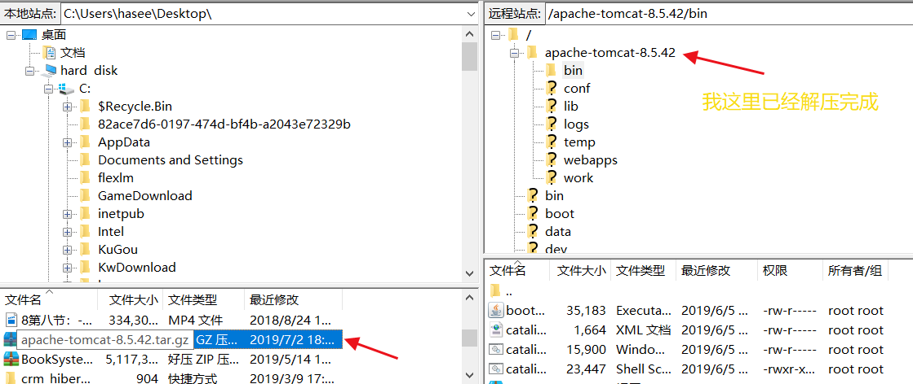
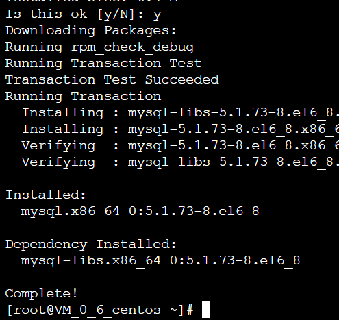

## 买服务器,买域名就不说了CenOS7(Linux)系统的

<!--more-->

## 1.重装系统选择默认的Java环境

## 2.登陆


## 3.安装jdk

输入  **yum search jdk**


这里安装一个1.8 输入**yum -y install  java-1.8.0-openjdk***

直到Complete！为止就算成功了

## 安装tomcat并把文件传到服务器



### 进入目录解压** apache-tomcat-8.5.42.tar.gz**


运行 **tar zxvf apache-tomcat-8.5.42.tar.gz** 解压

### 如果提示没有权限此时要进入tomcat的bin下给予权限**chmod u+x *.sh**


## 4.安装mysql

###  **yum install mysql**


输入Y



此时如果报错Error Summary，说明有冲突包删除即可

**yum -y remove mysql-community-common-5.6.26-2.el6.x86_64**

之后再次安装


### **yum install mysql-server**


### **yum install mysql-devel**


### **service mysqld start**

此时可能会出错


这时要运行，就是删除呗，刚开始建服务器的话也无所谓啦！

```linux
 setenforce 0 
rm -fr /var/lib/mysql*
rm /var/lock/subsys/mysqld 
killall mysqld*
```


成功启动了

### 设置安全组


### 左侧菜单栏 --安全组


### 新增关联 加入主机


### 上传java web 项目war包


放到tomcat下的webapps下

### 启动tomcat 

进入bin下startup.sh

启动完成ip+8080如果有tom猫就成功了

如果没有,

- 检查8080端口是否放行

- 如果你已经启动过tomcat关掉上一个shutdown
- ps -aux | grep tomcat查看tomcat占用情况
- kill 进程号
- 再次重启tomcat

如果不行的话就看我另一篇搭建文章基于宝塔面板的

### Linux常用命令

- vi 文件 (编辑文件)
- 输入i进入编辑状态此时最底下出现--insert--
- Esc退出编辑状态
- :wq保存
- :q!不保存
- cat 文件(查看文件)
- cd 路径(进入某一路径)
- ls 列出当前文件夹下的所有文件