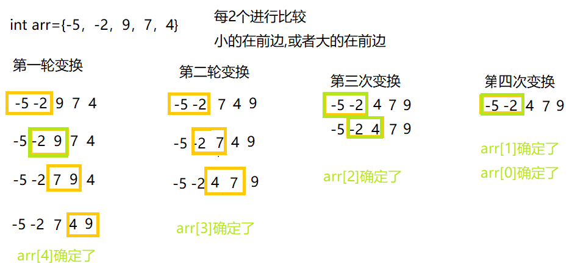
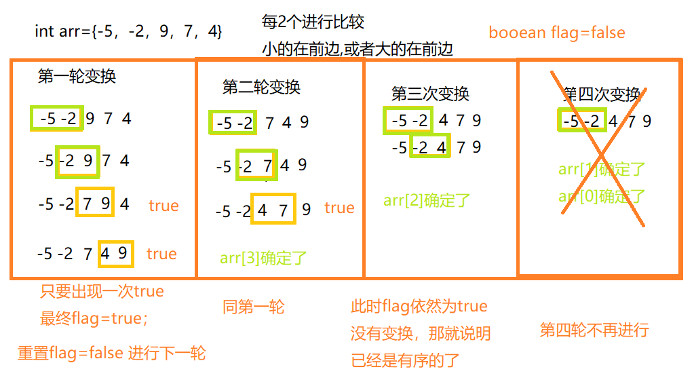

冒泡排序是较为简单的排序算法

比如对int[] arr={-5，-2，9，7，4}从小到大排序，n个元素就变换n-1轮 ，每一轮从最大的n-1次逐渐降低，两个for循环时间复杂度是O(n<sup>2</sup>)

<!--more-->

**通俗一点就是每一轮变换都将最大的放到最后**

绿色表示不用交换，黄色表示要交换



```java
public static int[] bubble(int[] arr) {
		for (int i = 0; i < arr.length-1; i++) {
			for (int j = 0; j < arr.length-1-i; j++) {
				//左边>右边,右边放大的
				if (arr[j]>arr[j+1]) {
					int temp=arr[j+1];
					arr[j+1]=arr[j];
					arr[j]=temp;
				}
			}
		}
		return arr;
	}
```

## 优化冒泡排序

**每一轮变换中都没有交换过，那就说明这个数组已经是有序的了，比如上图的第三轮和第四轮都没有交换，那么就不会进行第四轮变换**

每一轮变换中的每一步都没进行变换，那么flag就一直是false，说明已经有序



```java
public static int[] bubble2(int[] arr) {
		boolean flag=false;
		for (int i = 0; i < arr.length-1; i++) {
			for (int j = 0; j < arr.length-1-i; j++) {
				//左边>右边,右边放大的
				if (arr[j]>arr[j+1]) {
					flag=true;
					int temp=arr[j+1];
					arr[j+1]=arr[j];
					arr[j]=temp;
				}
			}
			if (!flag) {
				flag=true;
			}else {
				flag=false;
			}
		}
		return arr;
	}
```


