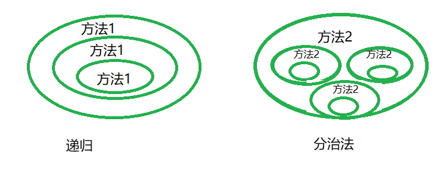

分治法就是把一个复杂的问题,分成n个小问题解决,使用递归方法,比如快速排序

<!--more-->

## 分治法与递归的区别

递归是不停调用自己,比如计算100的阶乘就用递归,是纵向的,

分治法里边使用了递归,横向+纵向,有一传十,十传百的感觉



## 汉诺塔

汉诺塔（又称河内塔）问题是源于印度一个古老传说的益智玩具。大梵天创造世界的时候做了三根金刚石柱子，在一根柱子上从下往上按照大小顺序摞着64片黄金圆盘。大梵天命令婆罗门把圆盘从下面开始按大小顺序重新摆放在另一根柱子上。并且规定，在小圆盘上不能放大圆盘，在三根柱子之间一次只能移动一个圆盘。

- 任何时候大的不能在小的上面
- 每次移动一个
- 把所有A的盘移到C


## 思路

分治法的思想就体现在这里

- 把64个盘分成上边63个和下面最大的,两个整体,63移动到B,把最大的移动到C
- 把63个盘,同理分成62个和下面最大的,62移动到A,把最大的移动到C
- 把62个盘,同理分成61个和下面最大的,61移动到B,把最大的移动到C
- 同理,总体的思路就是把上面的大整体移到B,分两份后把上面的大整体后移到C


```java
public class HanNota {
	private int i = 1;
	//汉诺塔,n个圆柱,3个柱子ABC,起始全在A,要依靠B,全部移到C,小的在大的上边
	public void hanNota(int n,char from,char dependOn,char to){
		if(n == 1){
			//只有一个那么直接输出
			System.out.println("第"+i+++"步从"+from+"-->"+to);
		}else{
			//第一步，先将n-1个盘子从A利用C挪到B
			hanNota(n-1,from,to,dependOn);
			//讲n这个盘子（底盘）从A挪到C
			System.out.println("第"+i+++"步从"+from+"-->"+to);
			//讲n-1个盘子从B利用A挪到C
			hanNota(n-1,dependOn,from,to);
		}
	}
	public static void main(String [] args){
		HanNota hanNota = new HanNota();
		hanNota.hanNota(4, 'A', 'B', 'C');
	}
}
```

