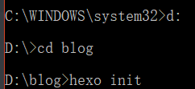
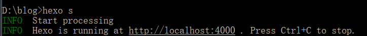
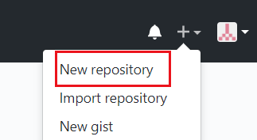
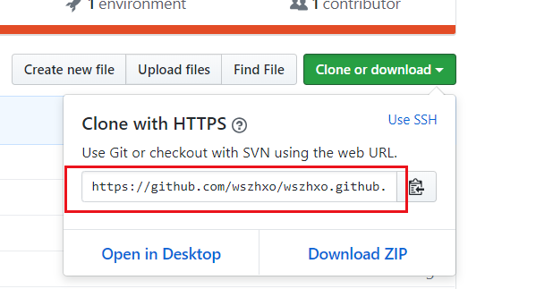

## 介绍如何利用Hexo博客框架创建GitHub Pages站点,搭建个人博客!

<!-- more -->

### 第一步:环境配置

你得有 [**node.js**](https://nodejs.org/en/)和  **[git](https://pc.qq.com/detail/13/detail_22693.html)**  我这里提供了最快的下载途径

cmd 中输入 检查是否安装成功     `git --version`        `npm -v `      `node -v`

### 开始安装Hexo框架,分别执行两条命令,**用管理员身份运行cmd**

`npm install -g cnpm --registry=https://registry.npm.taobao.org`

`cnpm install -g hexo-cli`

`hexo -v`         验证是否安装成功

## 第二步:本地创建项目

自建一个文件夹 然后进入文件下 比如 **D:/blog**  ,把Hexo安装进该文件夹里

`hexo s`   启动Hexo   [http://localhost:4000](http://localhost:4000)就可以访问了! 现在只是在本地而已!

新建文章    ,编辑的话可以用  [Typora](https://www.typora.io/)   这个软件

`hexo n "新建文章"`

刷新页面就可以看到了

需要先清理一下sources文件夹`hexo clean`
再生成  `hexo g`
重启 `hexo s` 

## 第三步:部署到github

新建仓库  (注册账号什么的自己解决,登录后右上角➕移上去,new  repository )

用户名.github.io 必须是这个格式  ,就会自动创建站点 ,完成即可

安装一个插件  `npm install hexo-deployer-git`

修改 -config.yml   文件 

最后的deploy下

`type: git`
`repo: 你的仓库项目路径`
`branch: master`

`hexo d`   推送到github 完成

### 访问 用户名.github.io   即可!

