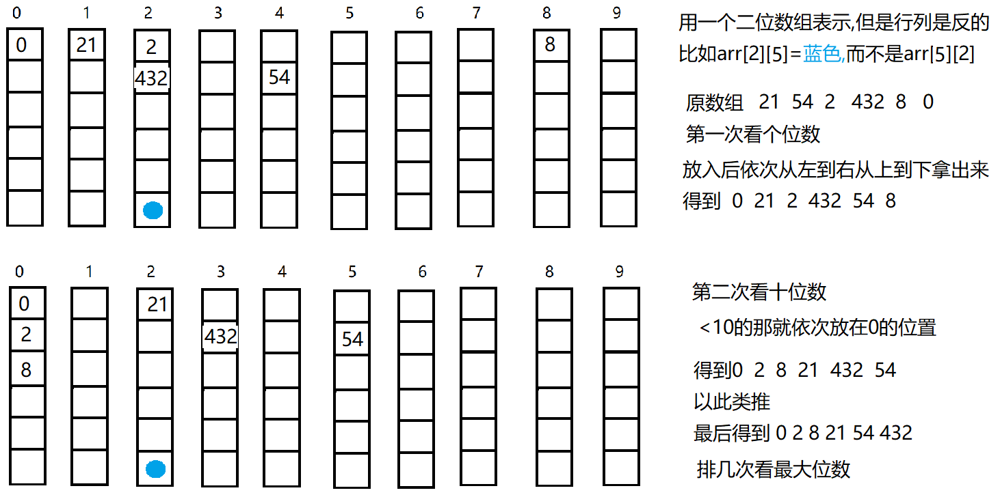

基数排序的发明可以追溯到1887年赫尔曼·何乐礼在打孔卡片制表机(Tabulation Machine)上的贡献。它是这样实现的：将所有待比较数值（**正整数**）统一为同样的数位长度，数位较短的数前面补零。然后，从最低位(个位)开始，依次进行一次排序(百位,千位以此类推)。这样从最低位排序一直到最高位排序完成以后, 数列就变成一个有序序列。基数排序法是属于稳定性的排序
<!--more-->

## 思路

**类似于10个桶,每个桶要排序的有几个元素就有几层因为考虑到极端情况所有数字全在一个桶里**用一个二维数组表示  int[][] bucket =new int[10] [arr.length]       

每一次放入10个桶中,再取出来,循环,就可以得到最后有序序列                         



## 代码

```java
// 基数排序
	public static int[] radixSort(int[] arr) {
		// 存放数字
		int[][] bucket = new int[10][arr.length];
		// 存放每列的个数
		int[] bucketsize = new int[10];

		// 最大是几位,把最大的给max
		int max = arr[0];
		for (int i = 1; i < arr.length; i++) {
			if (arr[i] > max) {
				max = arr[i];
			}
		}
		int maxbit = (max + "").length();
		// 个十百千 变化,i仅仅是让n*10而已
		for (int x = 0, n = 1; x < maxbit; x++, n *= 10) {
			// 放的过程,遍历数组,插入到对应的二维数组中
			for (int j = 0; j < arr.length; j++) {
				int bit = arr[j] / n % 10;
				//bucketsize[bit]刚开始默认0,插入完后+1
				bucket[bit][bucketsize[bit]++] = arr[j];
			}
			// 拿出的过程
			int index = 0;
			for (int i = 0; i < 10; i++) {
				//每个桶遍历,覆盖原数组
				if (bucketsize[i] > 0) {
					for (int j = 0; j < bucketsize[i]; j++) {
						arr[index++] = bucket[i][j];
					}
				}
				//每次拿出以后,该桶中元素个数要重置,
				bucketsize[i] = 0;
			}
		}
		return arr;

	}
```

