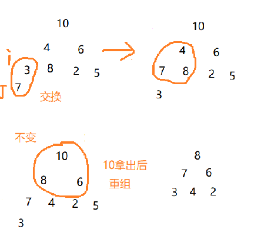

堆排序(Heapsort)是利用堆这种数据结构设计的一种排序算法,他是选择排序的一种,其实就是完全二叉树.堆分为大顶堆小顶堆.大顶堆其所有的子结点<=父节点,小顶堆其所有的子结点>=父节点,二叉树是一种逻辑机构,其表现形式还是数组.
<!--more-->

根据上篇文章(顺序存储二叉树),可以知道其含义

- 大顶堆:一个数组arr[i]>=arr[ix2+1]左节点和arr[i]<=arr[ix2+2]右节点
- 小顶堆:一个数组arr[i]<=arr[ix2+1]左节点和arr[i]<=arr[ix2+2]右节点

## 代码实现



**研究了很久,还是只了解第一个步骤就是大顶堆时,总是把大的慢慢交换上去**

```java
//i是叶子结点的父节点
	public static void Heapsort(int[] arr,int i,int length) {
		for (int j = 2*i+1; j < length; j=2*j+1) {
			//左节点小于右节点
			if (j+1<length&&arr[j]<arr[j+1]) {
				//j指向最大的那个值
				j++;
			}
			//子节点大于父节点,那么交换
			if (arr[i]<arr[j]) {
				//交换
				int temp =arr[i];
				arr[i]=arr[j];
				arr[j]=temp;
				
				i=j;
			}else {
				break;
			}	
		}
		
	}
```

## 关键代码

这一步我始终搞不清楚,太乱了,也许我现在的水平还不允许我理解,我只是把我当前的理解写在注释上

```java
//堆排序
	public static void heapsort(int[] arr) {
		//arr.length/2-1是公式,代表叶子结点的父节点
        //这一步是在很难懂
		for (int i = arr.length/2-1; i >=0; i--) {
			Heapsort(arr,i,arr.length);
		}
		for (int i = arr.length-1; i >=0; i--) {
			//大的总是放到数组最后
			int temp =arr[0];
			arr[0]=arr[i];
			arr[i]=temp; 
            //重组二叉树
			Heapsort(arr,0,i);
		}
		System.out.println(Arrays.toString(arr));
	}
```

## 测试类

```java
	 int[] arr = { 10,4,6,3,8,2,5,7 };
		heapsort(arr);
//输出[2, 3, 4, 5, 6, 7, 8, 10]
```

