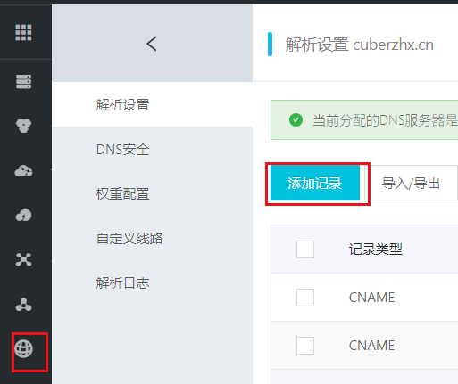
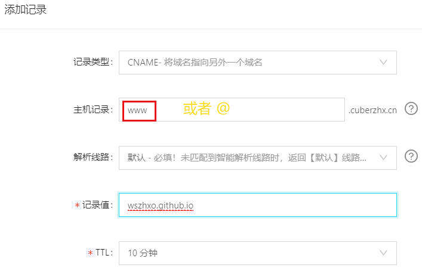
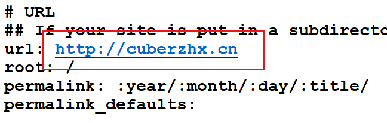

## 个人域名怎么样绑定到自己的GitHub Pages站点呢?

<!-- more -->

## [阿里云购买域名](https://www.aliyun.com/)     

购买域名后需要**备案**,备案前需要**实名认证**,花了几分钟就可以完成了

点击自己用户名 -进入管理控制台 -域名-

完成 启用

## 在github上配置CNAME记录类型

### 第一种方法 :  

回到github项目create new file   CNAME   写入买的域名即可不过,每次hexo d都需要重新写入

### 第二种方法:  

**在blog文件下,安装插件**  输入命令

`npm install hexo-generator-cname --save`

#### 修改_config.yml下的url

#### 

重新 `hexo clean`  `hexo  g -d` 刷新网页

就可以用域名访问个人博客啦 !

