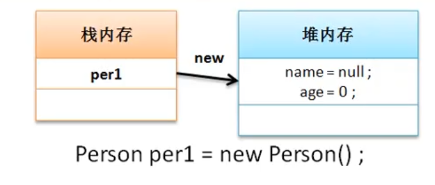
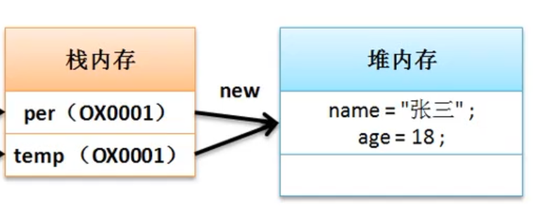

大家都知道想要一个对象直接new就可以了

比如**Person  p1=new Person();**
这里内存发生了什么?
<!--more-->

## 内存分析

栈内存: 里边存了对象的地址,比如你在纸上记下了我的地址浙江金华某地

堆内存:栈内存所指向的具体实例,比如,浙江金华某地的具体的房子



对象实例化时就给里边的属性自动赋默认值空或0


### 这时给他赋值

```java
per1.name="张洪祥";
per1.age=18;
```

堆内存的值也就变了

### 如果没有实例化就赋值

```java
Person per1=null;
per1.name="张洪祥";
per1.age=18;
```

这样的话就报错**NullPointerException**

一切的原因都是你没有实例化对象,比如我还没出生,我爸被我起名字张洪祥,人都没有,你叫我,我会应你吗?,直接报空!

## 引用分析

### 引用传递

```
 Person  张洪祥=new Person();
 Person  张三=张洪祥;
```

别人给我取个外号叫张三,你叫我张三,我也会应你;

栈内存里存了两个地址,都指向堆内存空间

我叫张洪祥,也叫张三,都指向我这个人



执行```张三.age=20 ``` 那么堆内存的age值也会变成20

如果我写了一个方法执行,而不是直接```张三.age=20 ``` 

```java
public static change(Person p){
张三.age=20;
}
```

参数是Person类,那么这个方法执行完毕后,栈内存的地址就消失了,没了

### 值传递

值传递只存在于基本数据类型中,创建```int a=1;```就会在栈中直接创建为1 的变量,没有所谓的堆内存了

```java
int a=1;
int b=a;
```

此时修改b=2,那么a还是为1,因为栈内存里分别有a,b两个区域,只是刚开始值都是1


