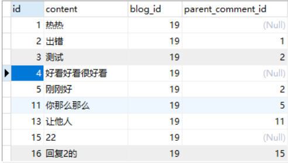
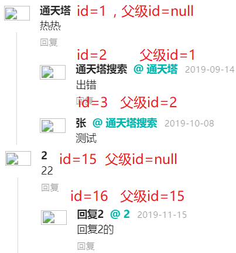
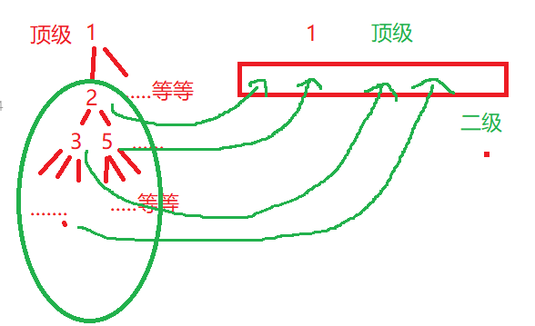
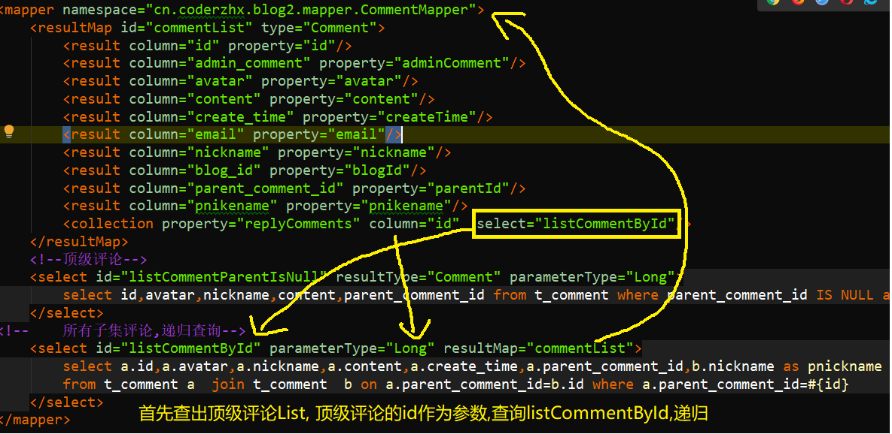

> 评论作为博客系统不可或缺的一部分,可以增加互动,各大网站评论功能是必须有的,这篇文章利用Mybatis 的+Thymeleaf实现评论+回复评论功能

<!--more-->

## 思路

1.数据库表的设计核心 评论id ,文章id,内容content,父级评论id.其他就不阐述了

2.页面原型,参考各大网站,最多只能有两个层级的评论

3.实体类设计Comment中有父级Comment,还有子评论的Comment集合

4.后台逻辑的处理:怎么把层层级联关系分为最多只有两层的设计

## 数据库设计

| -名字             | -类型   | 描述       |
| ----------------- | ------- | ---------- |
| id                | bigint  | 评论id     |
| content           | varchar | 评论内容   |
| blog_id           | bigint  | 文章id     |
| parent_comment_id | bigint  | 父级评论id |

这里只写了核心的字段



## 页面设计



可以看出最多只有两层评论,**问题就是怎么把类似于一棵树的数据,转化为同一级**



## 实体类设计

```java
public class Comment implements Serializable {
    private Long id;
    private String content;//评论内容
    private String nickname;//昵称
    private Long blogId;//评论的文章id
    private Long parentId;//父级评论id;
    private String pnickname;//父级昵称
    private List<Comment> replyComments = new ArrayList<>();//存储有关该id 的所有子评论
```

## Mybatis 设计

利用Mybatis 的resultMap形成**递归查询**



查询出的结果可想而知id=1下有包含了id=2的,而2的包含了3和5的,层层往下,类似于病毒扩散,一传十,十传百!

## 后台逻辑处理

最终要把n深度的层级关系转化为同一级

首选声明一个成员变量`List<Comment> tempReplys ;`用于存储最终的第二级别评论,顶级评论有几条,他就会创建几个.

```java
 //1.列出一级评论
        List<Comment> commentList = commentMapper.listCommentParentIsNull(blogId);
        //2.除一级以外的级联评论类似于一棵树,有多层
        for (Comment comment : commentList) {
            List<Comment> comments = commentMapper.listCommentById(comment.getId());
            //3.把上述的一级除外的评论,转化为二级评论放到一级评论commentList下的每个Comment的集合List<Comment>中
            //回复顶级评论的可能有多个所以要循环
            for (Comment c : comments) {
                System.out.println(c.toString());
                 tempReplys = new ArrayList<>();
                chageToChildList(c);

                comment.setReplyComments(tempReplys);//添加到一级评论的List下形成只有两级的评论
            }
        }
```

如果学过数据结构与算法的的话,应该对这种代码很熟悉,就是递归

```java
 //用于转化为二级集合,递归
    void chageToChildList(Comment comment){
        tempReplys.add(comment);
        if(comment.getReplyComments().size()>0){
            for (Comment c : comment.getReplyComments()) {
                chageToChildList(c);
            }
        }
    }
```

**这些代码我都会在我的博客2.0版本中开源出来,在我的github上,大家可以参考!**

## 回复功能

这个功能就是添加,表单隐藏域有文章id和父评论id,显示域有内容,邮箱,昵称,总共5个关键属性提交到后台.

具体的功能可以去我的github找到博客2.0找具体的代码,注释写的很明了.

