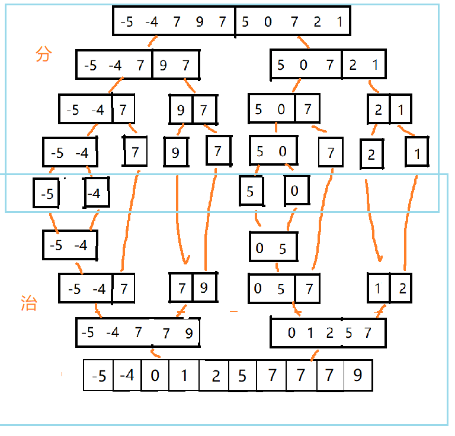
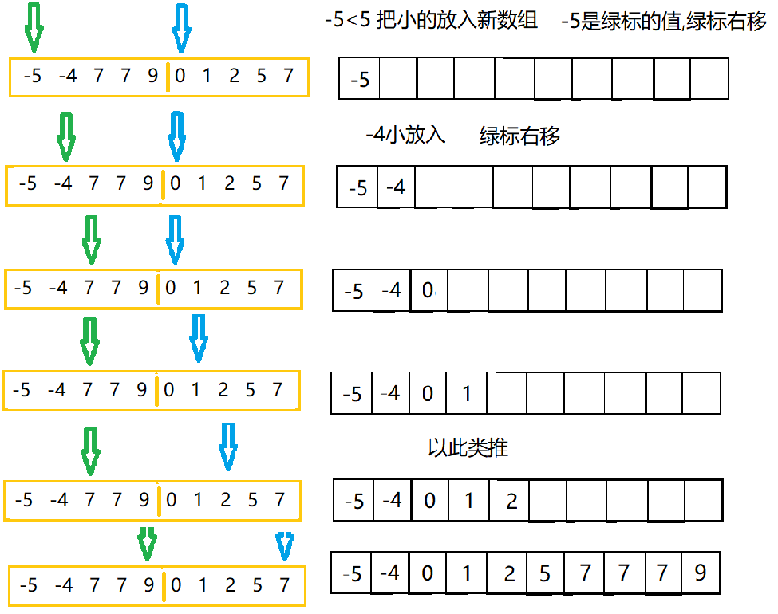

归并排序是典型的空间换时间的算法,其中采用递归非常合适

归并排序（MERGE-SORT）是建立在归并操作上的一种有效的排序算法,该算法是采用分治法（Divide and Conquer）的一个非常典型的应用。将已有序的子序列合并，得到完全有序的序列；即先使每个子序列有序，再使子序列段间有序。若将两个有序表合并成一个有序表，称为二路[归并](https://baike.baidu.com/item/归并/253741)。
<!--more-->



## 举例底下两层的具体实现过程

思路比较就是找到小的放入新数组,再用新数组替换原数组,

当**某一个**下标到达最右边时(**绿标到9数字的位置,蓝标到7数字的位置**),把另一个下标右边的剩下值放入新数组,



```java
//归并排序原数组,新数组
	public static void mergeSort(int[] arr, int left,int mid ,int right,int[] temp) {
		int l=left;//左半部分的起始位置
		int r=mid+1;//右半部分的起始位置
		int index=0;
		//循环结束代表l,r下标某一个已经遍历完了
		while(l<=mid&&r<=right) {
			if (arr[l]<=arr[r]) {
				temp[index++]=arr[l++];
			}else {
				temp[index++]=arr[r++];
			}
			
		}
		//左边下标没到mid，把剩下的加到数组temp
		while(l<=mid) {
			temp[index++]=arr[l++];
		}
		//右边下标没到right，把剩下的加到数组temp
		while(r<=right){
			temp[index++]=arr[r++];
		}
		
		//慢慢的把每次小段的排好序的数字替代arr的数字
		index=0;
		while(left<=right) {
			arr[left++]=temp[index++];
		}
	}
	
	//分为小段过程
	public static void merge(int[] arr, int left ,int right,int[] temp) {
		if (left<right) {
			int mid = (left+right)/2;
            //左部分
			merge(arr,  left ,mid, temp);
            //右部分
			merge(arr, mid+1, right,temp);
			//治的过程
			mergeSort(arr,  left ,mid,right,temp);
		}
	}
```

