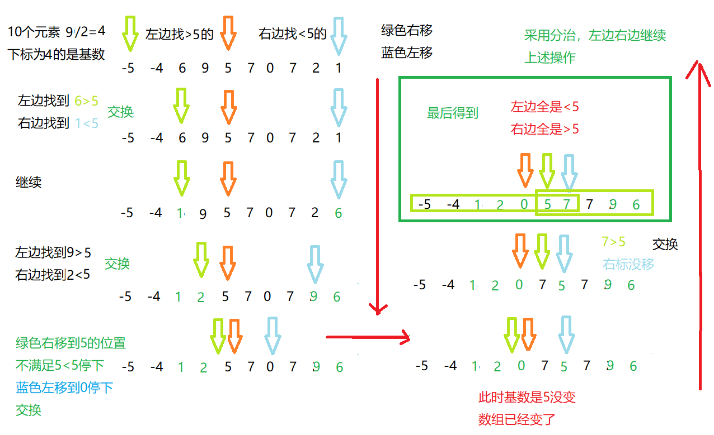

快速排序是对冒泡排序的优化版

**首尾下标相加/2得到基值下标，确定参照值，小的放左边大的放右边**，

-  1.首部下标往右，找到>=参照值时停下，尾部下标往左，找到<=参照值时停下

- 2.此时交换值，以此类推，结束后，左边全部小于参照值，右边全部大于参照值

- 左右两部分递归，开始循环12操作

<!--more-->



```java

	// 快速排序
	public static int[] quick(int[] arr, int left, int right) {
		int l = left;
		int r = right;
		int center = arr[(right + left) / 2];
		while (l <= r) {
			// 左边找比参考值大的,找不到继续++
			while (arr[l] < center) {
				l++;
			}
			// 右边找比参考值小的,找不到继续--
			while (arr[r] > center) {
				r--;
			}
			if (l >= r) {
				break;
			}
			// 交换值
			int temp = arr[r];
			arr[r] = arr[l];
			arr[l] = temp;
			//遇到两个值相等岂不是一直在交换,那就是死循环
			if (arr[l]==center) {
				r--;
			}
			if (arr[r]==center) {
				l++;
			}
		}
		//防止栈溢出
		if (l==r) {
			l++;
			r--;
			
		}
		//左半部分递归
		if (left<r) {
			quick(arr,left,r);
		}
		//有半部分递归
		if (right>l) {
			quick(arr,l,right);
		}
		return arr;
	}
```

