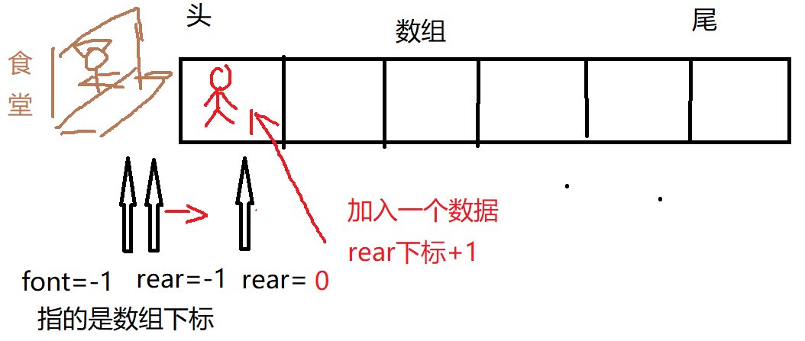
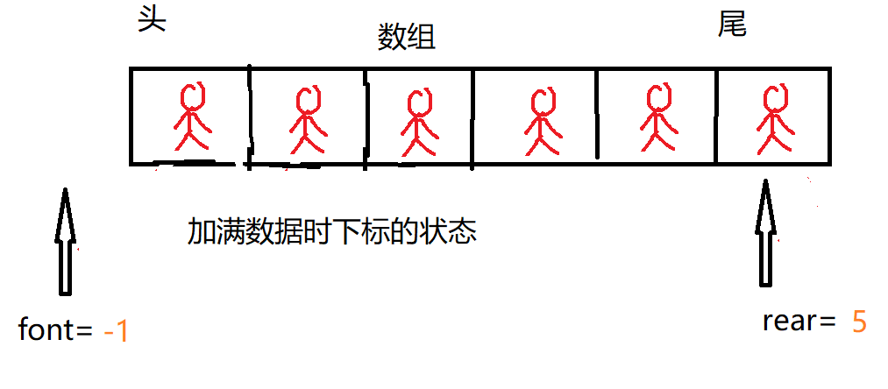
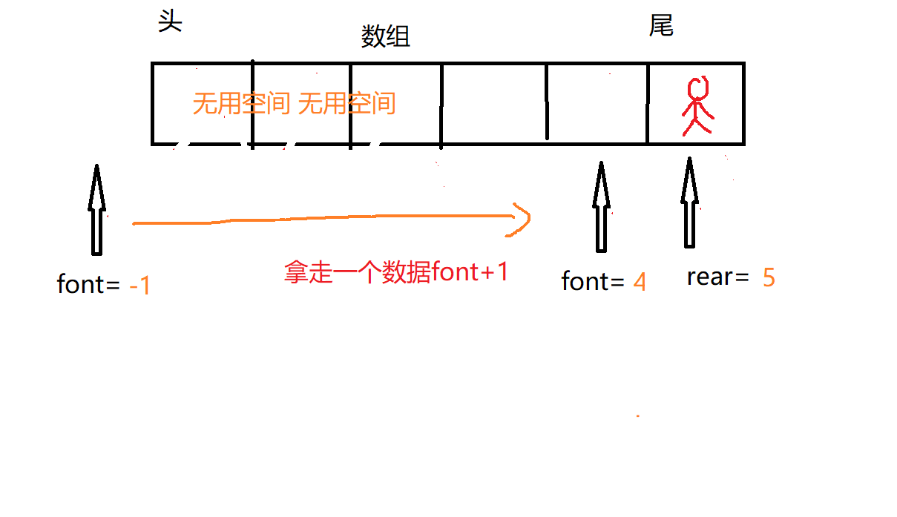
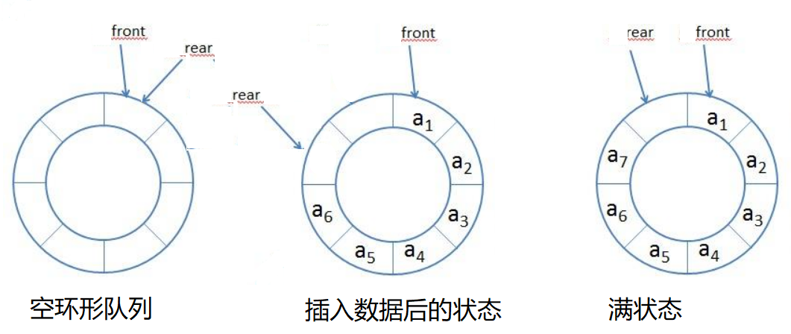

队列的特点就是先选先出,就像排队有先来后到

<!--more-->

从头开始打菜，尾部排队

队列有一个最大存储空间size。这里为6个







## 不成熟版代码实现

```java

class Queue{
	private int size;//队列最大存储空间
	private int font=-1;//队列头部下标
	private int rear=-1;//队列尾部下标
	private int[] arr;
	
	//构造方法传入队列大小
	public Queue(int size){
		this.size=size;
		arr=new int[size];
	}
	//是否满
	public boolean isFull() {
		return rear==size-1;
	}
    //是否为空
	public boolean isEmpty() {
		return font==rear;
	}
	//尾部添加
	public void add(int value) {
		if (this.isFull()) {
			throw new RuntimeException("队列已满");
		}
		rear++;//尾部下标+1
		arr[rear]=value;//并赋值
		
	}
	//从头拿出数据
	public int get() {
		if (this.isEmpty()) {
			throw new RuntimeException("队列空");
		}
		font++;//头部下标+1
		return arr[font];//并赋值
		
	}
	//遍历展示队列
	public void show() {
		if (this.isEmpty()) {
			throw new RuntimeException("队列空");
		}
		for (int i = font+1; i <rear; i++) {
			System.out.printf(" arr[%d]=%d ", i, arr[i]);
		}
	}
	
	//获取头部，取出，队列数据变少了
	public int getHead() {
		if (this.isEmpty()) {
			throw new RuntimeException("队列空");
		}
		return arr[font+1];
	}
}
```

**这个队列就如上图所画的，拿走数据后的空间没有利用而队列已满是根据rear下标判断，那么这个模拟队列不完整，因此得用环形队列**

## 环形队列



**font指向头元素的下标，初始值都为0，此时的空间看上去像是8实际只有7，因为rear永远指向加入的最后一个元素的后一个位置，如果加入arr[7]=a8，那么rear和font都是指向同一块，空状态和满状态该如何判断呢？所以必须空出一块**


rear可以无限加，因此要正确表示下标，可以用取模方式rear=（rear+1）%size ，所以 rear永远在0 -7间循环

如果a1被取走，然后font+1，那么font也可以无限加，因此也使用取模运算font=（font+1）%size，为了font永远在0-7之间循环

~~~java
class CircleQueue{
	private int size;//队列最大存储空间
	private int font;//队列头部下标默认0
	private int rear;//队列尾部下标
	private int[] arr;
	
	//构造方法传入队列大小
	public CircleQueue(int size){
		this.size=size;
		arr=new int[size];
	}
	
	public boolean isFull() {
		return font==(rear+1)%size;
	}
	public boolean isEmpty() {
		return rear==font;
	}
	//尾部添加
	public void add(int value) {
		if (this.isFull()) {
			throw new RuntimeException("队列已满,不能添加");
		}
		arr[rear]=value;//并赋值
		rear=(rear+1)%size;//尾部下标+1
		
	}
	//从头依次拿出
	public int get() {
		if (this.isEmpty()) {
			throw new RuntimeException("队列空,不能拿出");
		}
		int value= arr[font];//并赋值
		font=(font+1)%size;//头部下标+1
		return value;
		
	}
	//遍历展示队列
	public void show() {
		if (this.isEmpty()) {
			throw new RuntimeException("队列空,不能展示队列");
		}
		//rear会出现比font小的情况因此不能写(rear-font)%size,会出现负数
		for (int i = font; i <font+ (rear+size-font)%size; i++) {
			System.out.printf(" arr[%d]=%d \n", i%size, arr[i%size]);
		}
	}
	
	//获取头部
	public int getHead() {
		if (this.isEmpty()) {
			throw new RuntimeException("队列空,不能获取头");
		}
		return arr[font];
	}
}
~~~

