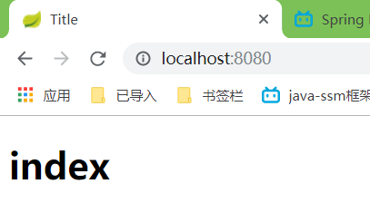
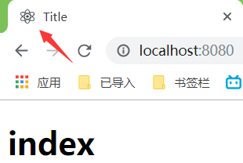

## 新建Spring Boot的一些小问题

<!--more-->

## 1.不能加载 com.mysql.jdbc.Driver 问题

改为com.mysql.cj.jdbc.Driver

## 2.报错信息

```

***************************
APPLICATION FAILED TO START
***************************
Description:
Failed to auto-configure a DataSource: 'url' is not specified and no embedded datasource could be auto-configured.
Reason: Failed to determine a suitable driver class
Action:
Consider the following:
	If you want an embedded database (H2, HSQL or Derby), please put it on the classpath.
	If you have database settings to be loaded from a particular profile you may need to activate it (no profiles are currently active).

Process finished with exit code 1


```

因为既然导入了起步依赖就得在application.properties中有相关数据库配置

比如我导入了mybatis,就得在properties配置

```JAVA
# DataSource
spring.datasource.url=jdbc:mysql://localhost/blog?characterEncoding=utf-8
spring.datasource.username=root
spring.datasource.password=123456
spring.datasource.driver-class-name=com.mysql.cj.jdbc.Driver


# mybatis配置 mybatis.config-location=classpath:mybatis-config.xml // 配置文件位置
mybatis.type-aliases-package=cn.coderzhx.pojo
# mybatis.typeAliasesPackage=cn.cuberzhx.springboot.pojo // 实体类包
mybatis.mapper-locations=classpath:mapper/*.xml // mapper文件位置
```


## 3.启动Application.java进不了Controller层

controller层文件夹要与Application.java要同级

## 4.加入访问静态资源的包webjars 

### 因为创建的Spring Boot是jar不是war所以要导入

我用的Layui前端框架

```xml
<dependency>
	<groupId>org.webjars</groupId>
    <artifactId>layui</artifactId>
    <version>2.4.6-SNAPSHOT</version>
<dependency>
```

同理jQuery,Bootstrap

```xml
<!-- jQuery -->
        <dependency>
            <groupId>org.webjars</groupId>
            <artifactId>jquery</artifactId>
            <version>3.3.1</version>
        </dependency>
        <!-- bootstrap -->
        <dependency>
            <groupId>org.webjars</groupId>
            <artifactId>bootstrap</artifactId>
            <version>4.0.0</version>
        </dependency>
```

### 默认访问resources下的以下文件夹/resources , / maven ,/static  ,/public 

比如,访问localhost:8080/balabala.js  ,balabala.js资源就是在上述文件夹下的

在resources下新建这些文件夹的任意都可以

### 也可以自定义在application.properties下写,但是写了之**后默认的就失效**了

**spring.resources.static-location=classpath:/hello/,classpath:/sa/,以此类推**

### 访问<http://localhost:8080/>默认找上述任意资源文件夹下的index.html



### 同理放置小图标在上述任意文件夹下

**favicon.ioc**必须这个名字,规定的你可以去相关官方类里查看



### 使用Thymeleaf

导入依赖就不说了

所有的模版默认要放在/templates文件下下边

例子:controller层

```java
   @RequestMapping("/hehe")
    public String hehe(){
        return "hehe";
    }
```

访问<http://localhost:8080/hehe>

