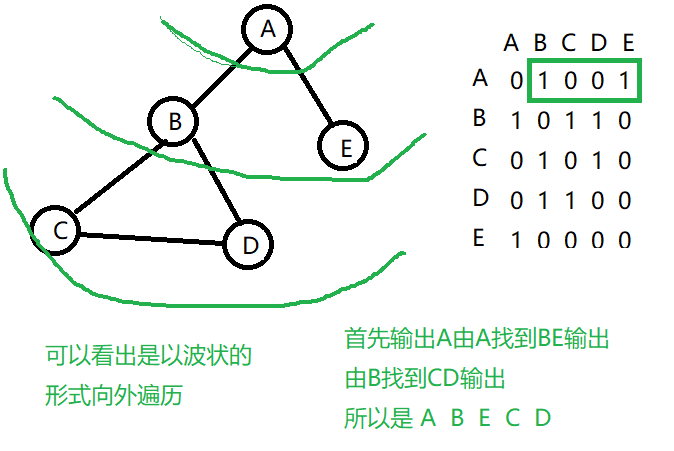

没有方向的图,但是每个点之间总有连通的路 ,这篇文章主要讲述深度优先遍历和广度优先遍历,用java实现两个算法,如下图无向图用二位数组表示,连通代表1

<!--more-->


## 二维数组实现无向图

```java
class Graph{
	public ArrayList<String> list;//用于存储结点
	public int[][] arr;//用于存储是否连通,连通为1
	public boolean[] bs;//用于判断结点是否被访问
	public int count;//连通的线的条数
	
	public Graph(int n) {
		count=0;
		arr=new int[n][n];
		bs=new boolean[n];
		list=new  ArrayList<String>(n);
	}
    //
    public void addLine(int v1,int v2) {
		arr[v1][v2]=1;
		arr[v2][v1]=1;
		count++;
	}
}
```

### 添加连通线

```java
		Graph graph=new Graph(5);//5个结点
		ArrayList<String> arrayList = graph.list;
		添加结点,对应下标分别是 0 1 2 3 4
		arrayList.add("A");
		arrayList.add("B");
		arrayList.add("C");
		arrayList.add("D");
		arrayList.add("E");
		//AB  AE  BC  BD  CD 
		graph.addLine(0,1);
		graph.addLine(0,4);
		graph.addLine(1,2);
		graph.addLine(1,3);
		graph.addLine(2,3);
```

**结果如上图的二位数组**

## 深度优先遍历

连通的有:AB  AE  BC  BD  CD 

- **A**开始找第一个没访问过的连通点**B**,
- **B**找第一个没访问过的连通点**C**,
- **C**找第一个没访问过的连通点**D**
- D连通点BC都已访问过,同理回退到A的第二个结点E,结束
- 输出A B C D E


**把以下方法添加到类Graph**

```java
//寻找下一个邻结点b的下一个的下标
	//比如b=1,那么a就是2或3或4
	public int findNeighbourNode(int a,int b) {
		for (int i = b+1; i < arr.length; i++) {
			if (arr[a][i]==1) {
				return i;
			}
		}
		return -1;
	}
	//深度优先遍历
	public void dfs(boolean[] bs,int v1) {
		//输出结点
		System.out.print(list.get(v1)+"->");
		//表示已经走过
		bs[v1]=true;
		int w = findNeighbourNode(v1,0);
		//说明存在结点
		while (w!=-1) {
			//只要还没访问过,继续往下遍历
			if (!bs[w]) {
				dfs(bs,w);
			}
			//否则就是换上一个结点的第二个节点
			 w=findNeighbourNode(v1,w);
		}
	}
	public void dfs() {
		//循环只要是没走过的都走一遍
		for (int i = 0; i < arr.length; i++) {
			if (!bs[i]) {
				dfs(bs,i);
			}
		}
	}
```

## 广度优先遍历



```java
//广度优先遍历
	public void bfs(boolean[] bs,int v1) {
		LinkedList<Integer> linkedList=new LinkedList<>();
		//输出结点
		System.out.print(list.get(v1)+"->");
		//表示已经走过
		bs[v1]=true;
		//队尾添加
		linkedList.addLast(v1);
		while(!linkedList.isEmpty()) {
			//拿出队头
			int u=(Integer)linkedList.removeFirst();
			int w = findNeighbourNode(u,0);
			//说明存在结点
			while (w!=-1) {
				//只要还没访问过,继续往下遍历
				if (!bs[w]) {
					//输出结点
					System.out.print(list.get(w)+"->");
					//表示已经走过
					bs[w]=true;
					linkedList.addLast(w);
				
				}
				//否则就是换上一个结点的第二个节点
				w=findNeighbourNode(u,w);
			}
			
		}
	}
	public void bfs() {
		//循环只要是没走过的都走一遍
		for (int i = 0; i < arr.length; i++) {
			if (!bs[i]) {
				bfs(bs,i);
			}
		}
	}
	
```

## 举个更合适的例子


