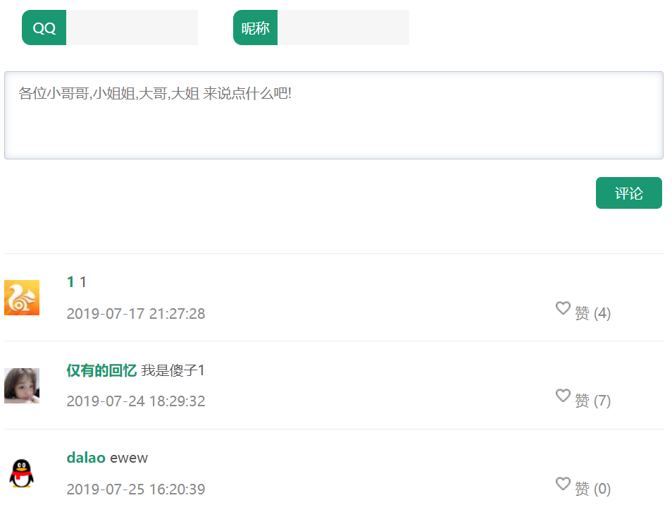

两者都用ajax请求实现,这是核心代码

```javascript
 $.ajax({
                type:"post",
                url:"/comment/"+zcommonid,
                success:function(data){return false;}
            });
```

<!--more-->

这是我的前端样式,我花了几小时嵌入我的项目中,根据一个jquery插件改的

这里提供3个

演示地址:https://eight1302.github.io/comments/view/index.html

源码1:https://github.com/eight1302/comments

源码2:https://www.lanrenzhijia.com/js/4780.html

下面那个是我采用的

演示地址:http://www.jq22.com/yanshi14103

源码下载:http://www.jq22.com/jquery-info14103



## 点赞功能思路

- 点赞按钮 

```html
<a class="1">赞</a>
<!--此时的class是1,js判断$(this).is('.1')点击的是不是class为1
是,就获取点赞数量+1,先生成静态效果,再ajax请求,因为这个请求一定不会报错除非后台代码写错了,后移除class="1" 添加class="2",取消点赞时
此时就不是class="1"了数量-1-->
<!--Restful风格请求,获取当前评论的id传到后台进行+1修改-->
$.ajax({
                type:"post",
                url:"/comment/"+zcommonid,
                success:function(data){return false;}
            });
```


- 留言

表单提交添加成功后,异步添加新加的评论,具体代码太长

```html
 <form id="cmtform" method="get">   
QQ<input type="text" id="qq" name="qq">
 昵称<input type="text" id="username" name="username">
   <input type="hidden" id="common" name="common">
                    <textarea  id="comment" class="content comment-input" placeholder="各位小哥哥,小姐姐,大哥,大姐 来说点什么吧!" onkeyup="keyUP(this)"></textarea>
                    <a id="submit" href="javascript:void(0)" class="plBtn">评论</a>
                    </form>
 

 $.ajax({
                type: "post",
                dataType: "text",
                url: "/comment/add" ,
                data: $('#cmtform').serialize(),
                success: function (data) {return false;}
            });
```

因为这个插件本身的原因,外包form后js效果就失效了,导致我要先获取textera的值赋值给name=common的input后提交

