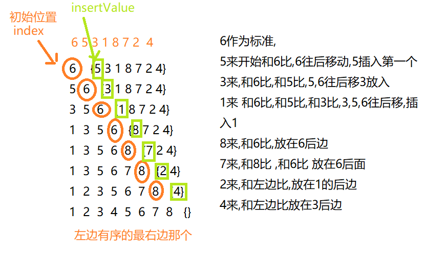

## 思路

把一个数组分成两份  左边是有序的,右边是无序的

<!--more-->



## 以下为动态图

取自[网友博客](https://blog.csdn.net/jiangying_emma/article/details/82222458)


## 代码实现

定义临时下标**index**左边有序中的最右边那个

定义下一个要插入的值**insertValue**右边无序中的第一个

index下标的值和insertValue比较,小的话index--,依次和左边的比较,

大的话插到index+1的后边

```java
public static int[] StraightInsertion(int [] arr){
		for (int i = 1; i < arr.length; i++) {
			int index=i-1;
			int insertValue=arr[i];
			while(index>=0&&insertValue<arr[index]) {
				//新插入的值insertValue和index下标的值比较,小的话,arr[index]后移
				arr[index+1]=arr[index];
				index--;
			}
            //
			arr[index+1]=insertValue;
			
		}
		return arr;
	}
```

