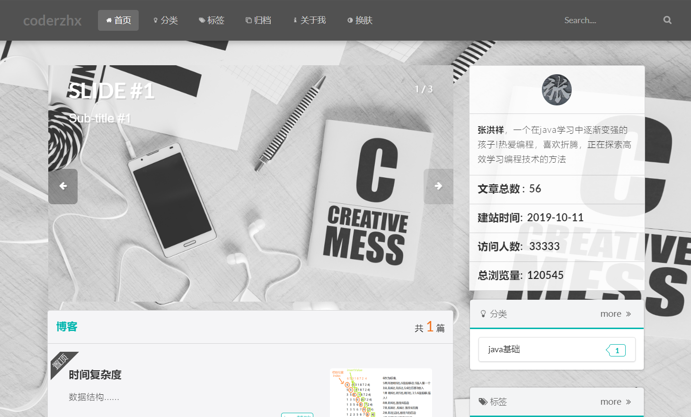

由于本人看腻了自己网站的颜色所以加入了这个功能,将会出现在我的博客2.0版本中,1.0版本是https://coderzhx.cn, 预计2.0在12月份上线
<!--more-->

## 核心思路:替换css文件

## 1.head中加入代码

```html
<link rel="stylesheet" href="/css/grey.css"  id="cssfile">
```

## 2.添加按钮

```html
<a  id="blue" >换肤</a>
```

## 3.监听点击事件

**id获取标签,监听点击,替换css文件**

```JavaScript
  <script>
    window.onload = function () {
      // 获得按钮
      var blue = document.getElementById('blue');
      //获得link
      var cssfile = document.getElementById('cssfile');
      var i=false;
      blue.onclick = function () {
        if (i%2==0) {
          cssfile.href = '/css/blue.css';
          i=true;
        }else{
          cssfile.href = '/css/grey.css';
          i=false;
        }

      }
    }
  </script>
```

## 效果




## 具体的css样式自己定义即可!