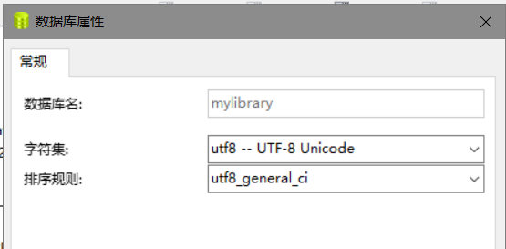
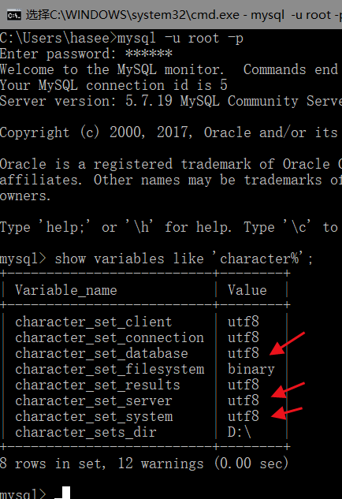
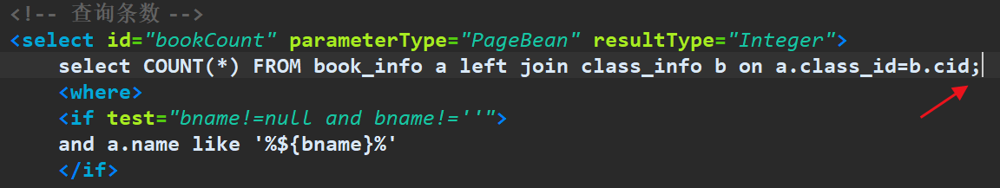

## 搜索功能中文关键字形成mysql语句时变成??的情况
<!--more-->

## 当我在做搜索查询的语句时出现了,中文搜索关键字中文变成??的形式

## 于是我在controller层,输出,发现,还是中文,变成查询语句时则变成了❓,于是上网百度,

### 1.开发环境编码格式,右键 属性 ,UTF-8没问题 ,

### 2.查看xml配置文件url中,也没问题

```
jdbc:mysql://localhost:3306/mylibrary?useUnicode=true&characterEncoding=utf8
```

### 3.数据库属性,也没问题




### 4,tomcat的server.xml文件,是不是忘加URIEncoding="UTF-8",发现也不是

```java
 <Connector URIEncoding="UTF-8" connectionTimeout="20000" port="8080" protocol="HTTP/1.1" redirectPort="8443"/>
```

### 5.修改了mysql的配置文件my.ini,全改为了utf8可还是乱码??



### 6.最后竟然是坑爹的多了一个分号,在mybatis查询语句中



### 由于查询语句还没结束我就打了分号,导致乱码,删掉就解决了!

