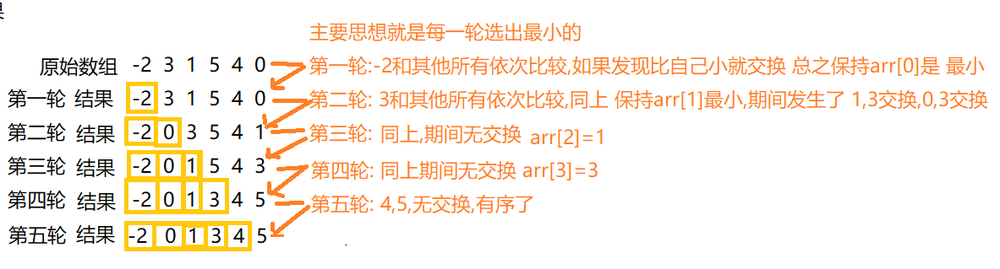

## 思想:

选择排序顾名思义,**每轮选出最小的(升序)或者最大的(降序)排到前边,**

一个n个元素的数组就需要n-1轮   ,时间复杂度O(n<sup>2</sup>)

<!--more-->



## 简单版本实现
```java
public static  int [] choice(int[]  arr) {
		for (int i = 0; i < arr.length; i++) {
			for (int j = i+1; j < arr.length; j++) {
				if (arr[j]<arr[i]) {
					int a=arr[i];
					arr[i]=arr[j];
					 arr[j]=a;	
				}
			}
		}
		return arr;
	}

```
```java
public static int[] Selection(int[] arr) {
		for (int i = 0; i < arr.length - 1; i++) {
			int min = i;
			for (int j = i + 1; j < arr.length; j++) {
				// 左边>右边,右边放大的
				if (arr[i] > arr[j]) {
					// arr[j]是当前最小的
					min = j;
				}
			}
			//如果arr[i]就是最小的就不交换
			if (min!=i) {
				 int temp= arr[min];
				arr[min] = arr[i];
				 arr[i]=temp;
			}

		}
		return arr;
	}
```

