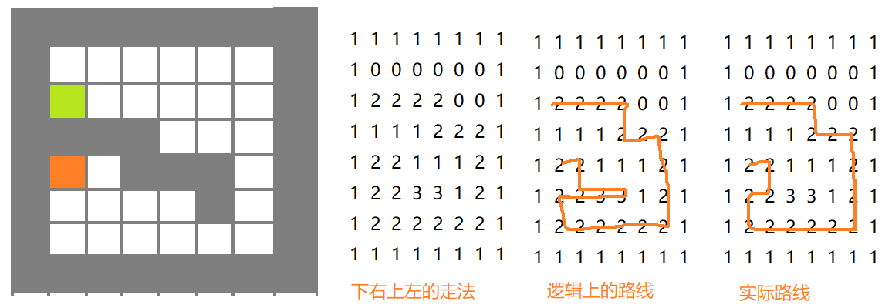

递归实际就是一种暴力查找,不停得调用自己,性能不佳,但代码简单
<!--more-->


## 生成8x8数组迷宫

```java
public static  int[] [] map(){
		int[] [] m=new int[8][8];
    //边框
		for (int i = 0; i < m.length; i++) {
			m[i][0]=1;
			m[i][7]=1;
		}
		for (int i = 0; i < m.length; i++) {
			m[0][i]=1;
			m[7][i]=1;
		}
    //障碍
		m[3][1]=1;
		m[3][2]=1;
		m[3][3]=1;
		m[4][3]=1;
		m[4][4]=1;
		m[4][5]=1;
		m[5][5]=1;
		return m;
	}
```

## 递归

下右上左的方法查找,1是路障,2走过也不能在走了,3回溯也不能走了

不能走用false表示,,走过的路用2表示,直到找到终点map[4][1]结束递归




```JAVA
public static boolean go(int[][] map ,int i,int j) {
    //终点坐标
		if (map[4][1]==2) {
			return true;
		}else {
			if (map[i][j]==0) {
				map[i][j]=2;
				if (go(map, i+1, j)) {//下
					return true;
				}else if (go(map, i, j+1)) {//右
					return true;
				}else if (go(map, i, j-1)) {//上
					return true;
				}else if (go(map, i-1, j)) {//左
					return true;
				}else {
					map[i][j]=3;
					return false;
				}
			}else {
				return false;
			}
		}
	}
```

上下左右顺序可以有24种组合

问题就在上下左右的if else 顺序问题,但我不知道怎么调整的思路

每一种组合的路线都是不同的,之中一定有最少的路线


