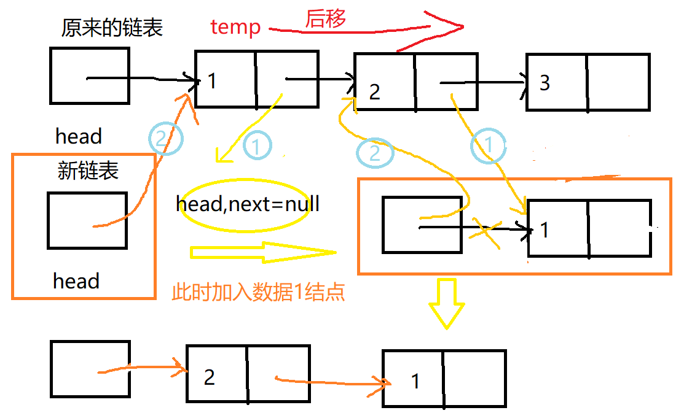

---

title: 面试题链表反转
categories:
  - java基础
tags:
 - 数据结构
 - 链表
abbrlink: 4
---

接[面向对象模拟单链表数据结构](http://coderzhx.cn/blog/49 "标题")的文章代码

腾讯的面试题,单链表元素的反转

## 链表反转思路

- 定义一个新的头结点head
- 遍历原来链表,把结点插到头结点和第一个结点之间
 <!--more-->



## 代码如下

```java
public void reversal() {
		PerNode temp=perNode.next;
		//新链表的头结点不变
		PerNode newtemp=new PerNode(0,"");
		PerNode newtemp2=null;
		if (temp==null) {
			System.out.println("链表为空");
		}
		while(temp!=null) {
			//暂时保存链表头结点的下一个的下一个,
			//仅仅因为temp=temp.next的下移操作要用到,
            //temp.next要后续操作会改变,所以要保存
			newtemp2=temp.next;
			
			//每加一个进来放到前边.核心操作
            //如图所示的1和2操作
			temp.next=newtemp.next;//1
			newtemp.next=temp;//2
			//下移
			temp=newtemp2;
		}
		perNode.next=newtemp.next;
	}
```

