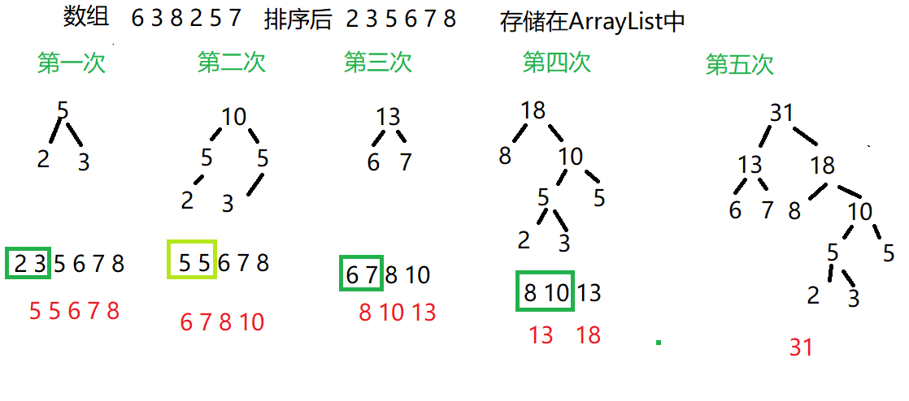

霍夫曼树是二叉树的一种特殊形式，又称为最优二叉树，其主要作用在于数据压缩和编码长度的优化。叫做最优二叉树的原因是:霍夫曼树的带权路径长度是最小的

<!--more-->

## 数组转化为霍夫曼树

霍夫曼树的带权路径是最小:叶子结点的权值:所有叶子结点*高度相加

WPL=2×6+2×7+2×8+2×10+2×7+3×5+3×5+4×2+4×3=不算了

### 思路



### 创建带权结点

```java
//定义树节点
//继承Comparable为了比较
class Node implements Comparable<Node>{
	public int value;//权值
	public Node left;//左节点
	public Node right;//右节点
	public Node(int value) {
		this.value = value;
	}
	@Override
	public int compareTo(Node o) {
		return this.value -o.value;
	}
	@Override
	public String toString() {
		return "Node [value=" + value + "]";
	}

}
```

### 生成霍夫曼数

```java
	public static Node createTree(int[] arr) {
		 ArrayList<Node> arrayList=new ArrayList<>();
		 for (int j = 0; j < arr.length; j++) {
			 arrayList.add(new Node(arr[j]));
		 }
		 Collections.sort(arrayList);
		 while(arrayList.size()>1) {
			 //拿出最小的两个
			 Node node = arrayList.get(0);
			 Node node2 = arrayList.get(1);
			 //组成一个二叉树
			 Node pNode=new Node(node.value+node2.value);
             //设置左右结点
			 pNode.left=node;
			 pNode.right=node2;
			 arrayList.remove(node);
			 arrayList.remove(node2);
			 arrayList.add(pNode);
			 //重新排序,直到只有一个节点
			 Collections.sort(arrayList);
			 System.out.println(arrayList);
		 }
		 return arrayList.get(0);
	}
```

### 测试输出

```java
	public static void main(String[] args) {
		 int[] arr = {6,3,8,2,5,7 };
		 createTree (arr);
	}

```

[Node [value=5], Node [value=5], Node [value=6], Node [value=7], Node [value=8]]
[Node [value=6], Node [value=7], Node [value=8], Node [value=10]]
[Node [value=8], Node [value=10], Node [value=13]]
[Node [value=13], Node [value=18]]
[Node [value=31]]

