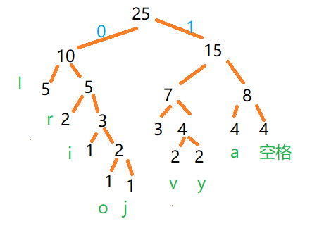
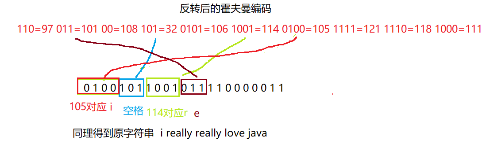

霍夫曼编码是基于霍夫曼树的常用于压缩和编码长度的优化,上一篇文章中介绍了霍夫曼树,本文就是来通过实现字符串的压缩来解释霍夫曼编码
<!--more-->

一段字符串  i really really love java 转化为字节数组  

i出现1次  空格出现4次  r出现2次  以此类推 可以得到

 **i=1 ,o=1, j=1 ,r=2 , y=2 ,v=2 , e=3 ,空格=4  ,a=4 , l=5**通过HashMap保存**拿出对应字母出现的次数作为权值排序后再组成霍夫曼树**上篇已经介绍如何生成霍夫曼树,



## 1.定义霍夫曼结点

```java
class HuffmanNode implements Comparable<HuffmanNode>{
	public Byte b;//字节对应的ASCII码
	public int value;//出现的次数,权值
	public Node left;//左节点
	public Node right;//右节点
	public HuffmanNode(Byte b,int value) {
		this.b = b;
		this.value = value;
	}
	@Override
	public int compareTo(HuffmanNode o) {
		return this.value -o.value;
	}
	@Override
	public String toString() {
		return "[b=" + b + ", value=" + value + "]";
	}
}
```

## 2.生成霍夫曼树

具体代码详解看上一篇霍夫曼树的文章

```java
	//生成霍夫曼树
	public static HuffmanNode createTree( byte[] bytes) {
		//键:字符对应ASCII码,值:出现次数
		 HashMap<Byte, Integer> map=new HashMap<Byte, Integer>();
		 for (byte b : bytes) {
			 Integer i= map.get(b);//获取出现次数
			if (i==null) {
				map.put(b, 1);
			}else {
				map.put(b, i+1);
			}
		}
		 //添加到ArrayList,为了创建霍夫曼树
		 ArrayList<HuffmanNode> arrayList=new ArrayList<>();
		 for (Entry<Byte, Integer> entry:map.entrySet()) {
			 arrayList.add(new HuffmanNode(entry.getKey(),entry.getValue()));
		}
		 Collections.sort(arrayList);
		 System.out.println(arrayList);
		 while(arrayList.size()>1) {
			 //拿出最小的两个
			 HuffmanNode node = arrayList.get(0);
			 HuffmanNode node2 = arrayList.get(1);
			 //组成一个二叉树
			 HuffmanNode pNode=new HuffmanNode(null,node.value+node2.value);
             pNode.left=node;
			pNode.right=node2;
			 arrayList.remove(node);
			 arrayList.remove(node2);
			 arrayList.add(pNode);
			 //重新排序,直到只有一个节点
			 Collections.sort(arrayList);
			 System.out.println(arrayList);
		 }
		 return arrayList.get(0);
	}
```

## 3.生成霍夫曼编码

**根节点出发左边0 右边1**

**l=00  r=010  i=0110  o=01110  j=01111  e=100 v=1010  y=1011  a=110   空格=111**

**霍夫曼编码:108=00 , 114=010  ,105=0110 , 111=01110 , 106=01111  , 101=100  ,118=1010 , 121=1011 , 97=110 ,  32=111** 

i really really love java因此就转化为**二进制的字符串**了,压缩率在20%-90%,而且是**无二义性**的!

0100101100101111000001111101100101111000001111101001000111001110101011101110110

树的形状可能有多种,因此霍夫曼编码也可能不同,但是最顶节点是25不会变而且生成的二进制长度也是不变的

```java
//产生二进制字符串
	public static StringBuilder binaryCode(byte[] bytes  ) {
		StringBuilder stringBuilder = new StringBuilder();
		for (byte b : bytes) {
            //huffmanCode就是哈夫曼编码
			stringBuilder.append(huffmanCode.get(b));
		}
		//System.out.println(stringBuilder.toString());
		return stringBuilder;
	}
```

## 4.压缩(字节数组保存)

0100101100101111000001111101100101111000001111101001000111001110101011101110110按照每8位生成对应的字节数组 ,设计到计算机组成原理的补码,反码,原码,这里有79个 转化为字节数组应该有10个元素

75 47 7 -39 120 62 -111 -50 -82 118 此时就压缩成功了

由于计算机存储数据时，都是以补码的形式进行存储。我们通常看到的数却是计算机存储的补码先转换成反码，后转换成原码，再转换成十进制呈现的。

- 第一个8位01001011(补码)首位是0那么直接计算二进制得到75 
- 第四个8位11011001首位是1 是符号位就是负数 那么去掉首位 取反+1 得到10100111  是-39   
- 最后只有7位 1110110 前面补0   那么就是01110110 得到118

原先字符串长度为25,现在是10  压缩率   15除以25等于60%的压缩率,字符串越长压缩效率越高

```java
//压缩
	public static byte[]   zip(StringBuilder stringBuilder  ) {
		//8位就是1长度，9位就算2长度了
		int len=(stringBuilder.length()+7)/8;
		byte[] bytes  =new byte[len];
		int index=0;
		for (int i = 0; i < stringBuilder.length(); i+=8) {
			//最后少于8个的值全部取出
			String string;
			if ( i+8>stringBuilder.length()) {
				string=stringBuilder.substring(i);
			}else {
				string=stringBuilder.substring(i, i+8);
			}
			bytes[index++]=(byte)Integer.parseInt(string,2);
			
		}
		return bytes;
	
	}
```

## 解压(逆向过程)

把字节数组->二进制字符串->根据霍夫曼编码得到原字符串

### 字节转为二进制

- 因为没有byte转二进制的方法,但是存在int转二进制的方法,所有把byte转成int,这就是temp  
- temp如果是负数 那么string其实有4个字节也就是32位,取末尾8位，temp如果是正数,那么string比如27转为二进制就是11011是5位则需要补全到8位,这就要由flag判断true则是正数，false则是负数
- 字节数组的最后一个，不需要补全，如果不全那么和原来的二进制字符串就不是同一个了，所以直接返回二进制即可
- 由此产生如下的方法

```java

//这有点难理解
	public static String  byteToBitString(boolean flag,byte b  ) {
       
		int temp=b;
		if (flag) {
			temp|=256;//与运算
		}
		//返回的是temp对应的二进制补码
		String string=Integer.toBinaryString(temp);
		if (flag) {
			return string.substring(strin.length()-8);
		}else {
			return string;
		}
	}
```

#### 反转后的霍夫曼编码

32=101 97=110 114=1001 101=011 118=1110 105=0100 121=1111 106=0101 108=00 111=1000

#### 二进制字符串

0100101100101111000001111101100101111000001111101001000111001110101011101110110



```java
	//(解压)二进制字符串转化为原字符串
	//传入霍夫曼编码，传入字节数组
	public static byte[] bitToStr(HashMap<Byte, String> huffmanCode ,byte[] b ) {
		//用于存储二进制字符串
		StringBuilder stringBuilder=new StringBuilder();
		for (int i = 0; i < b.length; i++) {
			byte c = b[i];
			//最后一个元素，不补全
			boolean flag=(i==b.length-1);
			stringBuilder.append(byteToBitString( !flag, c  ) )	;
		}
		System.out.println(stringBuilder);
		
		//反转霍夫曼编码表,因为不存在根据值找键的方法,只能根据键找值
		HashMap< String,Byte> map =new HashMap<>();
		for (Entry<Byte, String> entry : huffmanCode.entrySet()) {
			map.put(entry.getValue(),entry.getKey());
		}
		//存储字节
		ArrayList<Byte> list=new ArrayList<>();
//		int count=0;
		
		//用的到的二进制字符串还原
		for (int i = 0; i < stringBuilder.length(); ) {
			int count=1;
			String string;
			boolean flag=true;
			Byte c = null;
			while (flag) {
				if (i+count>stringBuilder.length()) {
					string=stringBuilder.substring(i);
					break;
				}
				//count一直递增,直到在编码表中找到对应的key
				string=stringBuilder.substring(i,i+count);
				c =map.get(string);
				if (c!= null) {
					//表示根据霍夫曼编码找了对应字节了,退出循环
					flag=false;
				}else {
					count++;
				}
			}
			list.add(c);
			i+=count;
		}
		byte[] bytes = new byte[list.size()];
		for (int i = 0; i < bytes.length; i++) {
			bytes[i]=list.get(i);
		}
		return bytes;
	}
	
```

## 测试类

```java

//二进制字符串
	static StringBuilder stringBuilder = new StringBuilder();
	//霍夫曼编码表
	static HashMap<Byte, String> huffmanCode = new HashMap<Byte, String>();
	public static void main(String[] args) {
		String string = "i really really love java";
		System.out.println(string.length());
		// 转为字节数组保存对应的ASCII码
		byte[] bytes = string.getBytes();
		// 根据出现次数来创建树
		HuffmanNode createTree = createTree(bytes);
		//创建霍夫曼编码表
		createHuffman( createTree.left, "0", stringBuilder);
		createHuffman( createTree.right, "1", stringBuilder);
	    System.out.println(huffmanCode);
	    StringBuilder binaryCode = binaryCode(bytes);
	    //二进制按8位转为字符数组
	    byte[] zip = zip(binaryCode);
	    for (byte b : zip) {
	    	System.out.print(b+" ");
		}
	    System.out.println();
	    //解压
	    byte[] bytes2=bitToStr(huffmanCode ,zip);
	    System.out.println(new String(bytes2));
	}
```

## 压缩图片

```java
	
	//压缩图片
//src要压缩文件的路径，outSrc压缩包路径
	public static void zipPic(String src,String outSrc) throws IOException {
		   
		FileInputStream fStream;
		FileOutputStream oStream;
		ObjectOutputStream oos;
		
		fStream=new FileInputStream(src);
		//创建和源文件大小一样的
		byte[] bytes = new byte[fStream.available()];
		fStream.read(bytes);
		
		
		//开始压缩
		HuffmanNode createTree = createTree(bytes);
		createHuffman( createTree.left, "0", stringBuilder);
		createHuffman( createTree.right, "1", stringBuilder);
		
		StringBuilder binaryCode = binaryCode(bytes);
		
		byte[] zip = zip(binaryCode);
		//输出到outSrc文件夹下
		oStream=new FileOutputStream(outSrc); 
        //转化为对象流
		oos=new ObjectOutputStream(oStream);
		//写入压缩字节数组
		oos.writeObject(zip);
		//写入霍夫曼编码
		oos.writeObject(huffmanCode);
		
		// 关闭流
		oos.close();
		oStream.close();
		fStream.close();
			    
	}
```

### 测试

```java
zipPic("C:\\Users\\hasee\\AppData\\Roaming\\Typora\\typora-user-images\/1569397704252.png","C:\\Users\\hasee\\Desktop\\22.zip");

```

此时就会在对应的路径产生文件了

## 解压图片


```java
	public static void unzipPic(String src,String outSrc) throws IOException, ClassNotFoundException {
			   
			InputStream fStream;
			OutputStream oStream;
			ObjectInputStream ois;
			
			fStream=new FileInputStream(src);
			//转化为对象流
			ois=new ObjectInputStream(fStream);
			//得到压缩后的字节数组
			byte[] byte1 =(byte[]) ois.readObject();
			@SuppressWarnings("unchecked")
			HashMap<Byte, String> huffmanCode1=(HashMap<Byte, String >) ois.readObject();
			//创建和源文件大小一样的
			//开始解压
			byte[] bytes2=bitToStr(huffmanCode1 ,byte1);
			oStream=new FileOutputStream(outSrc);
			oStream.write(bytes2);
			// 关闭流
			ois.close();
			oStream.close();
			fStream.close();
				    
		}
	
	
```


