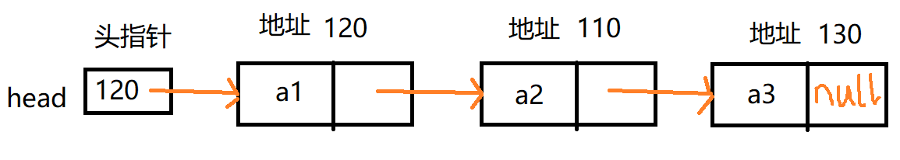

单链表是一种链式存取的数据结构，用一组地址任意的[存储单元](https://baike.baidu.com/item/存储单元/8727749)存放线性表中的[数据元素](https://baike.baidu.com/item/数据元素/715313)。链表中的数据是以结点来表示的，每个结点的构成：元素([数据元素](https://baike.baidu.com/item/数据元素/715313)的映象) + [指针](https://baike.baidu.com/item/指针/2878304)(指示后继元素存储位置)，元素就是存储数据的存储单元，指针就是连接每个结点的地址数据。

<!--more-->

## 底层物理结构

头结点不存放数据,仅仅存放下一个结点的地址


## 转化为逻辑结构

因为便于理解,一般会把单链表物理结构,转化为以下的逻辑结构表示,这样就浅显易懂了



## 创建结点实体类

```java
class PerNode{
	public int no;//序号
	public String username;
	public PerNode next;//下一个节点
	public PerNode(int no, String username) {
		super();
		this.no = no;
		this.username = username;
	}
	@Override
	public String toString() {
		return "PerNode [no=" + no + ", 
            username=" +  username + "]";
	}
}
```

## 创建结点操作类方法

```java
class SingleLinked{
    //头结点
	private PerNode perNode=new PerNode(0,"");
	//单链表添加到next为空的结点,方法就是一直循环查找,找到为止
	public void add(PerNode newNode) {
		//临时操作变量
		PerNode temp=perNode;
		//从头开始遍历,找到最后一个
		while(true) {
			if (temp.next==null) {
				break;
			}
			temp=temp.next;
		}
		//加入节点
		temp.next=newNode;
	}	
	public void list() {
		//头结点没有下一个说明为空
		if (perNode.next==null) {
			System.out.println("链表满了");
			return;
		}
		//临时操作变量
		PerNode temp=perNode.next;
		//循环输出,直到么有下一个了
		while(true) {
			if (temp==null) {
				break;
			}
			System.out.println(temp);
            //结点下移
			temp=temp.next;
		}
	}

}
```

## 测试类

```java
public static void main(String[] args) {
		SingleLinked singleLinked=new SingleLinked();
		singleLinked.add(new PerNode(1, "张三"));
		singleLinked.add(new PerNode(3, "李四"));
		singleLinked.add(new PerNode(2, "王五"));
		singleLinked.add(new PerNode(4, "赵六"));
		singleLinked.list();
	}

```

## 控制台结果

```java
PerNode [no=1, username=张三]
PerNode [no=3, username=李四]
PerNode [no=2, username=王五]
PerNode [no=4, username=赵六]
```

此时的插入是没有根据编号排序的

因此需要改进添加方法

## 顺序添加方法

把上述的add方法修改为addByOrder方法

- 每次添加需要遍历,

- 只要找到一个结点的编号大于当前添加的结点编号,那么就添加到这个结点的前边

- 否则就在后边
- 如果编号相同那么就不添加


```java
public void addByOrder(PerNode newNode) {
		//临时操作变量
		PerNode temp=perNode;
		boolean flag=false;
		//从头开始遍历,找到最后一个
		while(true) {
			//已经循环到底了,结束循环
			if (temp.next==null) {
				break;
			}
			//temp.next的编号比新加的编号大,那么找到了
			if (newNode.no<temp.next.no) {
				break;
			//temp.next的编号与新加的编号相同,那么不能添加
			}else if (newNode.no==temp.next.no){
				 flag=true;
				 break;
			}
			temp=temp.next;
		}
		if (flag) {
			System.out.printf("编号%d已存在!\n",temp.next.no);
		}else {
			//加入节点
			newNode.next=temp.next;
			temp.next=newNode;
		}
		
	}
```

## 测试类

```java
public static void main(String[] args) {
		SingleLinked singleLinked=new SingleLinked();
		singleLinked.addByOrder(new PerNode(1, "张三"));
		singleLinked.addByOrder(new PerNode(3, "李四"));
		singleLinked.addByOrder(new PerNode(2, "王五"));
		singleLinked.addByOrder(new PerNode(4, "赵六"));
		singleLinked.addByOrder(new PerNode(4, "赵六"));
		singleLinked.list();
	}
```

## 输出控制台

```java
编号4已存在!
PerNode [no=1, username=张三]
PerNode [no=2, username=王五]
PerNode [no=3, username=李四]
PerNode [no=4, username=赵六]

```

可以看到已经按照顺序排列了,这个功能我觉的还是很实用的,但我不知道具体应用到哪.


