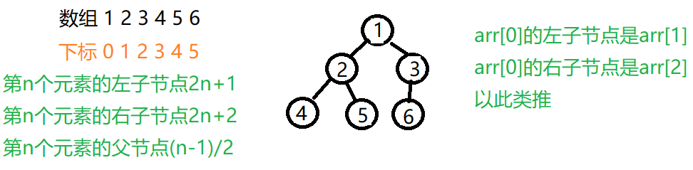

## 什么是二叉树顺序存储

二叉树顺序存储是二叉树的一种存储方式。将二叉树存储在一个数组中，通过存储元素的下标反映元素之间的父子关系。用于一些特殊场合，如结点个数已知的完全二叉树或接近完全二叉树的二叉树。**仅适用于完全二叉树**.

<!--more-->



## 先序中序后序遍历

```java
class ArrBinaryTree{
	public  int[] arr;
	public ArrBinaryTree(int[] arr) {
		this.arr = arr;
	}
	//先序遍历
	public void pre(int index) {
		if (arr==null||arr.length==0) {
			System.out.println("数组为空");
		}
		//中
		System.out.print(arr[index]+" ");
		//左递归
		if (2*index+1<arr.length) {
			pre(2*index+1);
		}
		//右递归
		if (2*index+2<arr.length) {
			pre(2*index+2);
		}
	}
	public void mid(int index) {
		if (arr==null||arr.length==0) {
			System.out.println("数组为空");
		}
		System.out.print(arr[index]+" ");
		//左递归
		if (2*index+1<arr.length) {
			pre(2*index+1);
		}
		//中
		//右递归
		if (2*index+2<arr.length) {
			pre(2*index+2);
		}
	}
	public void behind(int index) {
		if (arr==null||arr.length==0) {
			System.out.println("数组为空");
		}
		//左递归
		if (2*index+1<arr.length) {
			pre(2*index+1);
		}
		//右递归
		if (2*index+2<arr.length) {
			pre(2*index+2);
		}
		//中
		System.out.print(arr[index]+" ");
	}
}
```

## 测试

```java
public static void main(String[] args) {
		int [] arr= {1,2,3,4,5,6};
		ArrBinaryTree arrBinaryTree=new ArrBinaryTree(arr);
		System.out.println("先序遍历");
	 	arrBinaryTree.pre(0);//1 2 4 5 3 6
		System.out.println("中序遍历");
		arrBinaryTree.mid(0);//4 2 5 1 6 3
		System.out.println("后序遍历");
		arrBinaryTree.behind(0);//4 5 2 6 3 1 
	}

```


