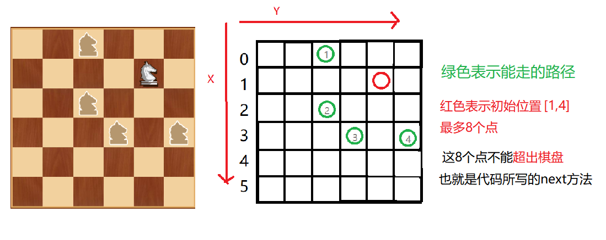
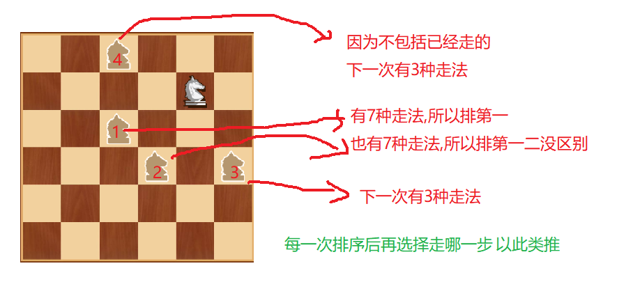

众所周知，🐎走法是按日字形状，马踏棋盘问题就是要求🐎能走遍所有的棋盘点

利用了回溯和穷举的思想，性能不是最好的！

<!--more-->

## 思路

- 类似于一传十，十传百，百传千的意思，直到找出覆盖了6x6=36的一种走法才算结束用一个boolean类型标志位记录
- 二维数组表示棋盘，ArrayList保存一个点能跳的其他点的数量，boolean[] 一维数组表示36个点是否已访问



## 代码


```java
// 棋盘
class ChessBoard {
	int size;// 棋盘宽高,按理说是正方形
	int[][] arr;// 棋盘
	boolean[] isVisited;// 记录棋盘某地是否被访问大小size平方
	boolean finished;// 记录棋盘是否全部被访问

public ChessBoard(int size) {
	this.size=size;
	isVisited = new boolean[size * size];
	arr = new int[size][size];
	finished = false;
}

// arr:棋盘 x:行 y:列 size:宽高 step:访问顺序
public void horse(int[][] arr, int x, int y, int step) {
	arr[x][y] = step;// 保存步数
	isVisited[x * size + y] = true;// 表示已经访问过
	// 表示该棋子能走的点的个数
	ArrayList<Point> list = next(new Point(x, y));
	// 只要可以走就遍历
	while (!list.isEmpty()) {
		// 拿出可以走的位置,拿光为止
		Point point = list.remove(0);
		// 没访问过
		if (!isVisited[point.x * size + point.y]) {
			horse(arr, point.x, point.y, step + 1);
		}
	}
	// 循环结束意味着,所有路径访问完毕
	if (step < isVisited.length && !finished) {
		// 表示走不通,恢复初始,即回溯
		finished = false;
		arr[x][y] = 0;
		isVisited[x * size + y] = false;
	} else {
		finished = true;
	}
}

// 每个点的下一个位置最多有8中情况
public  ArrayList<Point> next(Point point) {
	ArrayList<Point> ps = new ArrayList<Point>();
	Point p1 = new Point();
	if ((p1.x = point.x - 2) >= 0 && (p1.y = point.y - 1) >= 0) {
		ps.add(new Point(p1));
	}
	if ((p1.x = point.x - 1) >= 0 && (p1.y = point.y - 2) >= 0) {
		ps.add(new Point(p1));
	}
	if ((p1.x = point.x + 1) < size && (p1.y = point.y - 2) >= 0) {
		ps.add(new Point(p1));
	}
	if ((p1.x = point.x + 2) < size && (p1.y = point.y - 1) >= 0) {
		ps.add(new Point(p1));
	}
	if ((p1.x = point.x + 2) < size && (p1.y = point.y + 1) < size) {
		ps.add(new Point(p1));
	}
	if ((p1.x = point.x + 1) < size && (p1.y = point.y + 2) < size) {
		ps.add(new Point(p1));
	}
	if ((p1.x = point.x - 1) >= 0 && (p1.y = point.y + 2) < size) {
		ps.add(new Point(p1));
	}
	if ((p1.x = point.x - 2) >= 0 && (p1.y = point.y + 1) < size) {
		ps.add(new Point(p1));
	}
	return ps;
}
}
```
## 测试类

```java
public static void main(String[] args) {
		ChessBoard chessBoard = new ChessBoard(6);
		long start = System.currentTimeMillis();
		chessBoard.horse(chessBoard.arr, 1, 4, 1);
		long end = System.currentTimeMillis();
		System.out.println("共耗时: " + (end - start) + " 毫秒");
			for(int[] rows : chessBoard.arr) {
				for(int step: rows) {
					System.out.print(step + "\t");
				}
				System.out.println();
			}
	}
```

## 输出

```java

共耗时: 15 毫秒
8	23	2	21	32	25	
3	14	9	24	1	20	
10	7	22	31	26	33	
15	4	13	28	19	30	
36	11	6	17	34	27	
5	16	35	12	29	18	

```

**其实这里只走了35步,因为1到2的位置算走一步,那么到36就是35步,还差一步,最后数字1 的位置是空出来的那么,就是错误的,是因为策略的问题,就是一个棋子走下一步的可能性的选择顺序问题**

## 优化



### 非递减排序

7 7 3 3 1 0 ,意思就是有重复元素,而且是递减的

对每一次的集合都进行所以此时集合图中标记的顺序,因为他们的下一步可能性个数是 7 7 3 3 ,从1开始找,循环往复,速度大大提升

## 添加比较方法

```java
public  void sort(ArrayList<Point> ps) {
		ps.sort(new Comparator<Point>() {
			@Override
			public int compare(Point o1, Point o2) {
				//获取到o1的下一步的所有位置个数
				int count1 = next(o1).size();
				//获取到o2的下一步的所有位置个数
				int count2 = next(o2).size();
				if(count1 < count2) {
					return -1;
				} else if (count1 == count2) {
					return 0;
				} else {
					return 1;
				}
			}
		});
	}
```

## 修改horse方法

```java
public  void sort(ArrayList<Point> ps) {
		ps.sort(new Comparator<Point>() {

			@Override
			public int compare(Point o1, Point o2) {
				//获取到o1的下一步的所有位置个数
				int count1 = next(o1).size();
				//获取到o2的下一步的所有位置个数
				int count2 = next(o2).size();
				if(count1 < count2) {
					return -1;
				} else if (count1 == count2) {
					return 0;
				} else {
					return 1;
				}
			}
			
		});
	}
```

